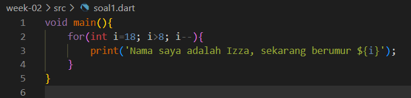

| Nama                                | Kelas | NIM        |
| ----------------------------------- | ----- | ---------- |
| Ulfi Mustatiq Abidatul Izza         | TI-3H | 2141720052 |

# Soal Nomor 1
Modifikasilah kode pada baris 3 di VS Code atau Editor Code favorit Anda berikut ini agar mendapatkan keluaran (output) sesuai yang diminta!

## Jawab :
#### code program

#### hasil output

# Soal Nomor 2
Mengapa sangat penting untuk memahami bahasa pemrograman Dart sebelum kita menggunakan framework Flutter ? Jelaskan!
## Jawab :
>Dart adalah bahasa pemrograman yang digunakan oleh framework Flutter. 
Menurut saya, dengan mempelajari bahasa pemrograman Dart secara mendalam membantu kita untuk memahami dasar-dasar pemrograman, seperti variabel, tipe data, struktur kontrol, fungsi, dan konsep-konsep bahasa pemrograman lainnya. Sehingga hal ini dapat mempermudah kita dalam memahami konsep-konsep yang digunakan dalam Flutter nantinya.

# Soal Nomor 3
Rangkumlah materi dari codelab ini menjadi poin-poin penting yang dapat Anda gunakan untuk membantu proses pengembangan aplikasi mobile menggunakan framework Flutter.
## Jawab :
Bahasa Dart adalah inti dari framework Flutter. Memahami Dart adalah dasar untuk bekerja dengan Flutter; pengembang perlu mengetahui asal-usul bahasa Dart, bagaimana komunitas mengerjakannya, kelebihannya, dan mengapa itu adalah bahasa pemrograman yang dipilih untuk Flutter.

### Evolusi Dart
Diluncurkan pada tahun 2011, Dart telah berkembang sejak saat itu.

- Awalnya berfokus pada pengembangan web, dengan tujuan utama menggantikan JavaScript, sekarang telah fokus pada mobile development, termasuk framework Flutter.
- Mencoba memecahkan masalah pada JavaScript: JavaScript tidak menyediakan ketahanan seperti banyak bahasa pemrograman lainnya.
- Menawarkan performa terbaik dan alat yang lebih baik untuk proyek berskala besar: Dart memiliki perkakas yang modern dan stabil yang telah disediakan oleh plugin IDE. 
- Dibentuk agar kuat dan fleksibel: Dengan tetap mempertahankan type annotations bersifat opsional dan menambahkan fitur OOP, Dart dapat menyeimbangkan dua fitur utama yaitu fleksibilitas dan ketangguhan.

Dart adalah bahasa modern yang luar biasa, mendukung lintas platform, dan memiliki tujuan umum dengan terus meningkatkan fitur-fiturnya, membuatnya lebih kekinian dan fleksibel. 

### Cara Kerja Dart
Untuk memahami dari mana fleksibilitas bahasa dart itu berasal, kita perlu tahu bagaimana cara mengeksekusi kode Dart. Ini dapat dilakukan dengan dua cara, seperti yang dijelaskan berikut ini:

- Dart virtual machines (VMs)
- JavaScript compilations

Pada bagian atas diagram adalah kode Dart. Perlu dicatat bahwa kode dan dependensi Anda bisa jadi tidak sesuai dengan cara Anda mengeksekusikan aplikasi; namun tidak perlu melakukan banyak perubahan pada kode Anda untuk dapat mendukung cross-platform.

#### Dart VM and JavaScript compilation
Eksekusi kode Dart dapat beroperasi dalam dua mode — kompilasi Just-In-Time (JIT) atau Kompilasi Ahead-Of-Time (AOT). Dijelaskan secara lebih rinci sebagai berikut:

- Kompilasi JIT adalah tempat kode sumber dikompilasi sesuai kebutuhan—Just in time. Dart VM memuat dan mengkompilasi kode sumber ke kode mesin asli (native).
- Kompilasi AOT adalah dimana Dart VM dan kode Anda dikompilasi sebelumnya, VM bekerja lebih seperti sistem runtime Dart, yang menyediakan garbage collector dan metode-metode native dari Dart software development kit (SDK) pada aplikasi. 

### Struktur Bahasa Dart
Apabila sudah mengetahui bahasa pemrograman seperti bahasa C dan javascript maka akan lebih mudah untuk memahami sintaks Dart.

#### Object orientation
Dart dirancang untuk object-oriented (OO). Secara singkat, Bahasa OOP didasarkan pada konsep objek yang menyimpan kedua data (disebut fields) dan kode (disebut methods). Objek-objek ini dibuat dari cetak biru yang disebut class yang mendefinisikan field dan method yang akan dimiliki oleh sebuah objek.

#### Dart Operator
Di Dart, operator tidak lebih dari method yang didefinisikan dalam class dengan sintaks khusus. Jadi, ketika Anda menggunakan operator seperti x == y, seolah-olah Anda sedang memanggil
x.==(y) metode untuk melakukan perbandingan kesetaraan.

#### Arithmetic operators
- '+' untuk tambahan.
- '-' untuk pengurangan.
- '*' untuk perkalian.
- '/' untuk pembagian.
- '~/' untuk pembagian bilangan bulat. Di Dart, setiap pembagian sederhana dengan / menghasilkan nilai double. 
- '%' untuk operasi modulus (sisa bagi dari bilangan bulat).
- '-expression' untuk negasi (yang membalikkan suatu nilai).

#### Increment and decrement operators
- ++var atau var++ untuk menambah nilai variabel var sebesar 1
- --var atau var-- untuk mengurangi nilai variabel var sebesar 1

#### Equality and relational operators
Persamaan operator Dart dijelaskan sebagai berikut:

- == untuk memeriksa apakah operan sama
- != untuk memeriksa apakah operan berbeda

Untuk melakukan pengujian relasional, maka gunakan operator sebagai berikut:

- '>' memeriksa apakah operan kiri lebih besar dari operan kanan
- '<' memeriksa apakah operan kiri lebih kecil dari operan kanan
- '>=' memeriksa apakah operan kiri lebih besar dari atau sama dengan operan kanan
- '<=' memeriksa apakah operan kiri kurang dari atau sama dengan operan kanan
#### Logical operators
Operator logika di Dart adalah operator yang diterapkan pada operan bool; bisa berupa variabel, ekspresi, atau kondisi.
- !expression negasi atau kebalikan hasil ekspresi yaitu, true menjadi false dan false menjadi true.
- || menerapkan operasi logika OR antara dua ekspresi.
- && menerapkan operasi logika AND antara dua ekspresi.

# Soal Nomor 4
Buatlah slide yang berisi penjelasan dan contoh eksekusi kode tentang perbedaan Null Safety dan Late variabel ! (Khusus soal ini kelompok berupa link google slide)!
## Jawab :
Link jawaban soal nomor 4 [klik disini](https://www.canva.com/design/DAFtcoxPAGE/g-DhZM3OsrT12VQp3lFBhQ/view)