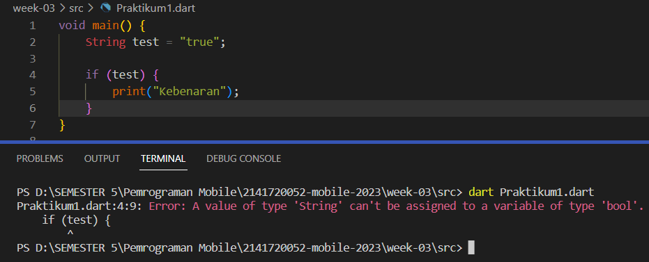
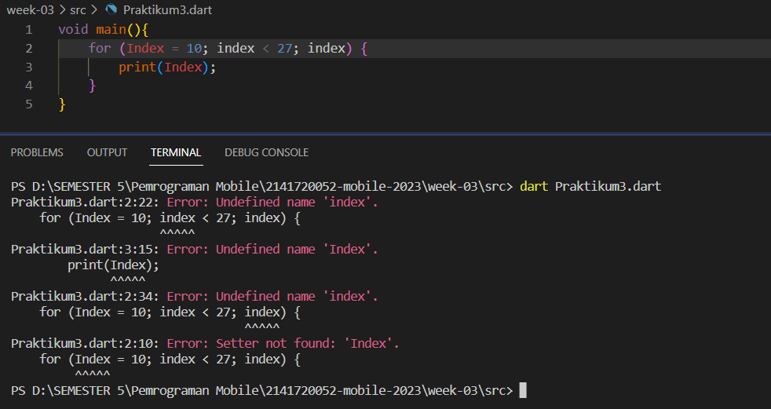

| Nama                                | Kelas | NIM        |
| ----------------------------------- | ----- | ---------- |
| Ulfi Mustatiq Abidatul Izza         | TI-3H | 2141720052 |

# Praktikum 1: Menerapkan Control Flows ("if/else")
## Langkah 1:

## Langkah 2:
> Penjelasan : Terjadi error karena terdapat beberapa kode program yang salah yaitu pada sintaks *else If* seharusnya **else if** dan *Else* seharusnya **else**, juda terdapat kesalahan pada perulangan yang kedua yaitu *if(test == "test") print* seharusnya sebelum print terdapat kurung kurawal terlebih dahulu **if(test == "test") {print("Test again")}**.

**PERBAIKAN**

## Langkah 3:

> Penjelasan : Terjadi error yang disebabkan oleh kurangnya kondisi pada perulangan if yaitu *if (test){ print("Kebenaran")}* seharusnya **if (test == "test2"){ print("Kebenaran")}**

**PERBAIKAN**

# Praktikum 2: Menerapkan Perulangan "while" dan "do-while"
## Langkah 1:

## Langkah 2:
>Penjelasan : Terjadi error yang disebabkan oleh tidak terdefinisikannya variabel counter sehingga, untuk memperbaikinya dilakukan dengan deklarasi dan inisialisasi terlebih dahulu pada variabel counter yaitu dengan menambahakan sintaks **int counter = 25;**

**PERBAIKAN**

## Langkah 3:

>Penjelasan : Terjadi error yang disebabkan oleh tidak terdefinisikannya variabel counter sehingga, untuk memperbaikinya dilakukan dengan deklarasi dan dan inisisalisasi terlebih dahulu pada variabel counter yaitu dengan sintaks **int counter = 65**. Dimana nanti ketika kode program dijalankan maka hasilnya akan menampilkan nilai yang dimulai dari angka 65 hingga batas kondisi yang sudah ada yaitu pada (counter < 77).

**PERBAIKAN**

#  Praktikum 3: Menerapkan Perulangan "for" dan "break-continue"
## Langkah 1:

## Langkah 2:
> Penjelasan : Terjadi error yang disebabkan oleh tidak terdefinisikannya variabel index atau Index sehingga, untuk memperbaikinya dilakukan dengan deklarasi terlebih dahulu pada variabel index yaitu **int index;** dan diikuti dengan menyamakan semua pemanggilan variabel index.

**PERBAIKAN**

## Langkah 3:

>Penjelasan : Terjadi banyak error yang disebabkan oleh 
- Pada sintaks *If* yang seharusnya **if**
- Pada sintaks *Else If* yang seharusnya **else if**
- Tidak terdefinisikannya variabel conter sehingga untuk memperbaiki nya dilakukan dengan **int index = 1;**
- Serta menambahkan perulangan for yang digunakan untuk menjalankan kondisi yang didalamnya yaitu pada **for (int index = 1; index <= 21; index++) { }**

**PERBAIKAN**

# Tugas
Buatlah sebuah program yang dapat menampilkan bilangan prima dari angka 0 sampai 201 menggunakan Dart. Ketika bilangan prima ditemukan, maka tampilkan nama lengkap dan NIM Anda.

**Jawab:**

## Penjelasan :
#### Fungsi Main :
- Mendefinisikan variabel nama dengan nilai "Ulfi Mustatiq Abidatul Izza" dan variabel nim dengan nilai "2141720051".
- Menggunakan loop for untuk iterasi variabel angka dari 0 hingga 201.
- Di dalam loop, memanggil fungsi bilPrima() untuk memeriksa apakah angka merupakan bilangan prima.
- Jika angka merupakan bilangan prima maka, akan mencetak pesan "Bilangan prima ditemukan: " diikuti dengan nilai angka, kemudian mencetak nama dan NIM.
#### Fungsi bilPrima :
- Menerima satu parameter angka yang merupakan bilangan yang akan diperiksa.
- Jika angka kurang dari 2 maka, akan  mengembalikan nilai false karena bilangan kurang dari 2 bukan bilangan prima.
- Menggunakan loop for untuk memeriksa apakah angka dapat dibagi habis oleh bilangan lain selain 1 dan angka itu sendiri.
- Jika angka dapat dibagi habis oleh suatu bilangan maka, akan  mengembalikan nilai false karena angka bukan bilangan prima.
- Jika loop selesai tanpa menemukan pembagi maka, akan mengembalikan nilai true karena angka adalah bilangan prima.
