| Nama                                | Kelas | NIM        |
| ----------------------------------- | ----- | ---------- |
| Ulfi Mustatiq Abidatul Izza         | TI-3H | 2141720052 |


# Praktikum 1: Membuat Project Flutter Baru

Membuat project flutter baru dengan nama **hello_world**

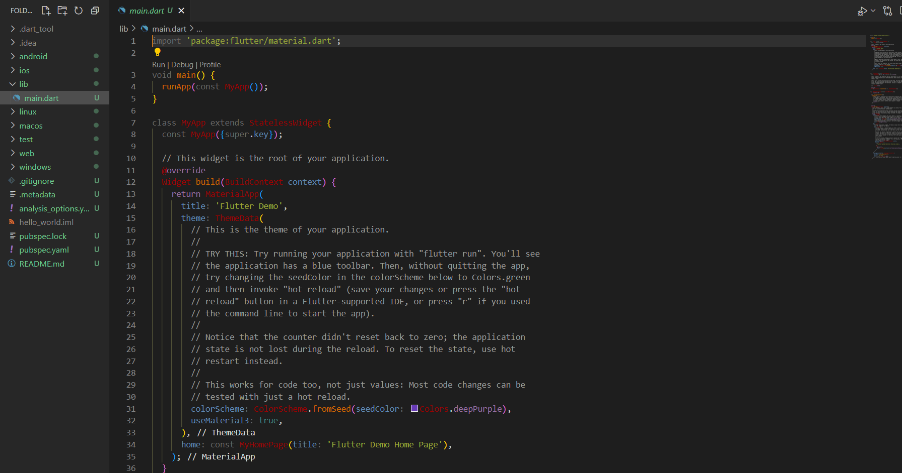

# Praktikum 2: Membuat Repository GitHub dan Laporan Praktikum

# hello_word

A new Flutter project

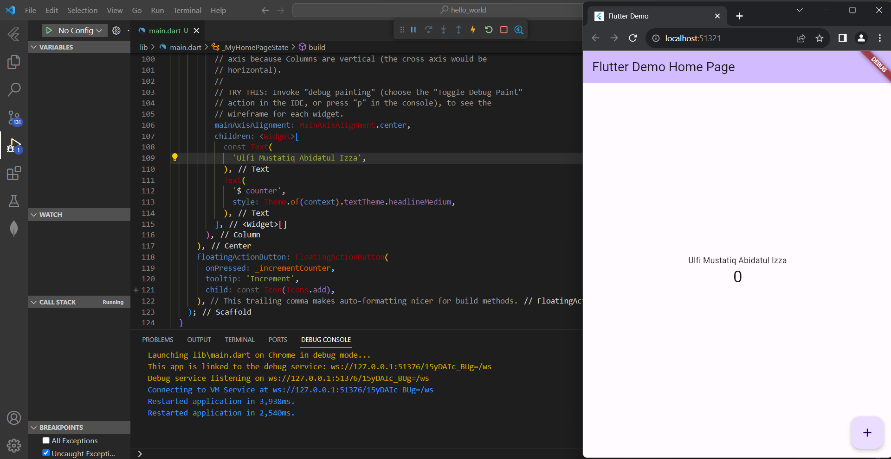

# Praktikum 3: Menerapkan Widget Dasar

#### Langkah 1: Text Widget

Mengganti teks menjadi nama lengkap saya dan berwarna merah.

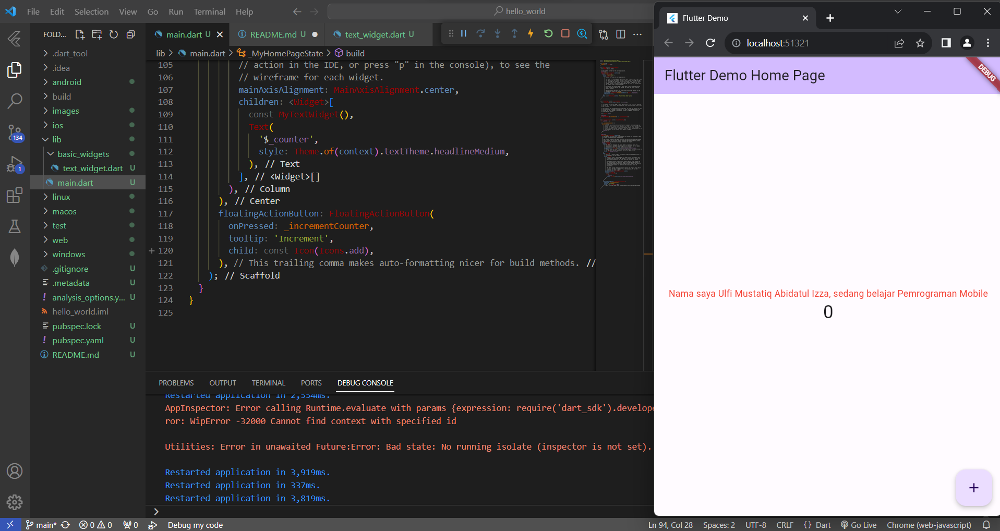

#### Langkah 2: Image Widget

Menambahkan logo polinema.

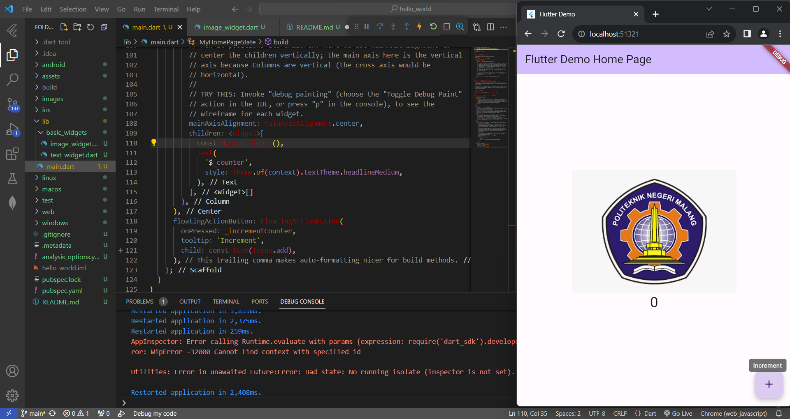

# Praktikum 4: Menerapkan Widget Material Design dan iOS Cupertino

#### Langkah 1: Cupertino Button dan Loading Bar

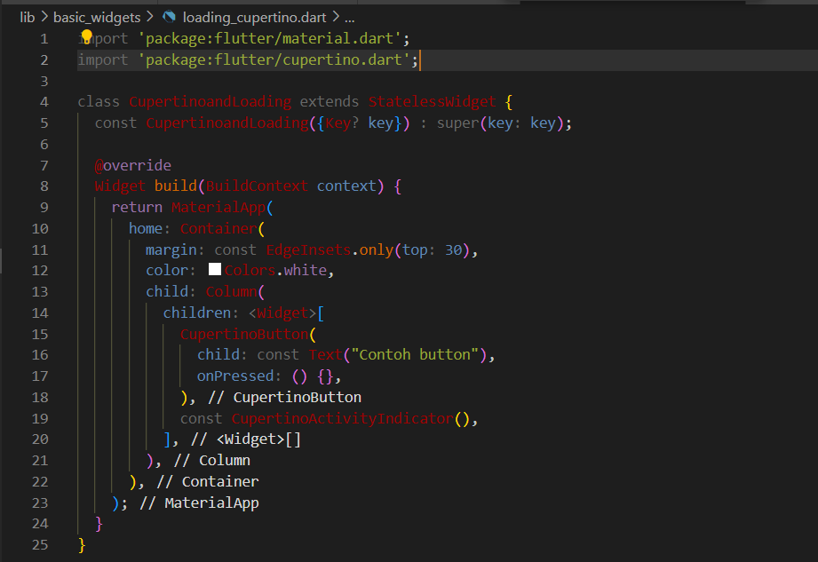

#### Langkah 2: Floating Action Button (FAB)

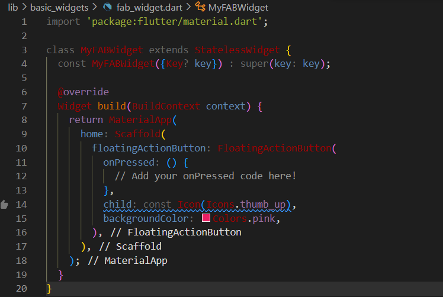

#### Langkah 3: Scaffold Widget

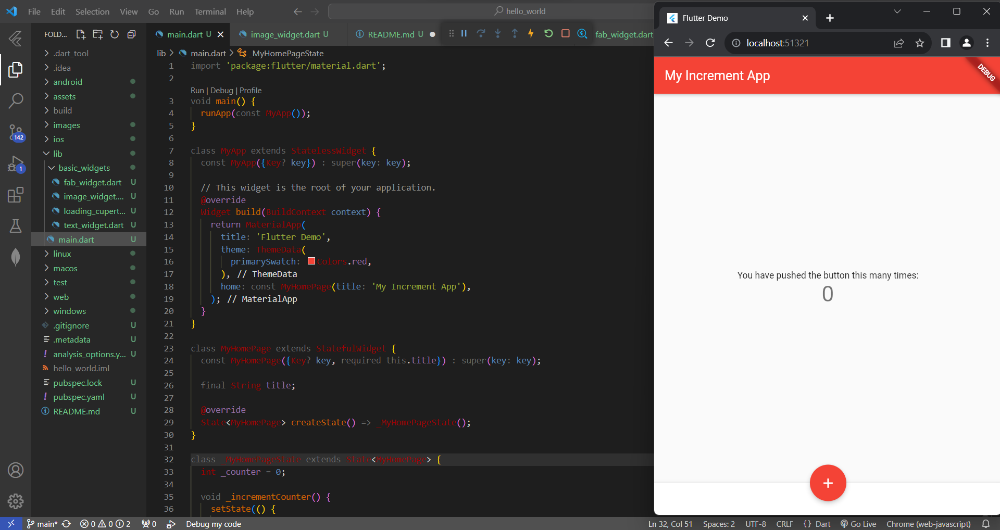

#### Langkah 4: Dialog Widget

Menambahkan dialog widget berupa alert dialog.

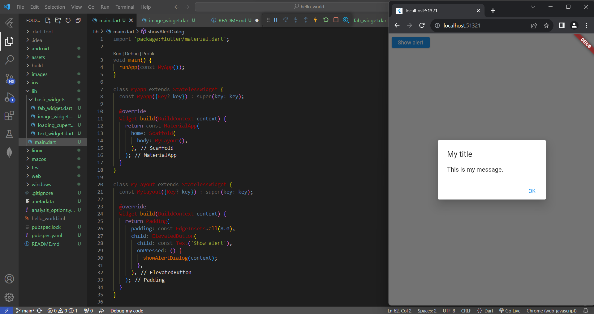

#### Langkah 5: Input dan Selection Widget

Menambahkan widget berupa input field untuk menerima inputan dari user, pada langkah ini dilakukan penambahkan TextField.

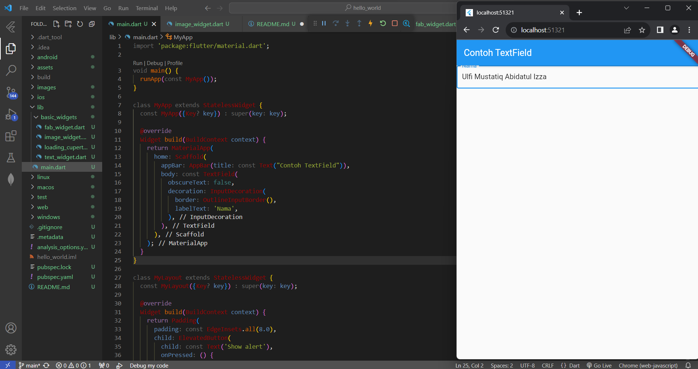

#### Langkah 6: Date and Time Pickers

Menambahkan selection widget berupa date and time pickers.

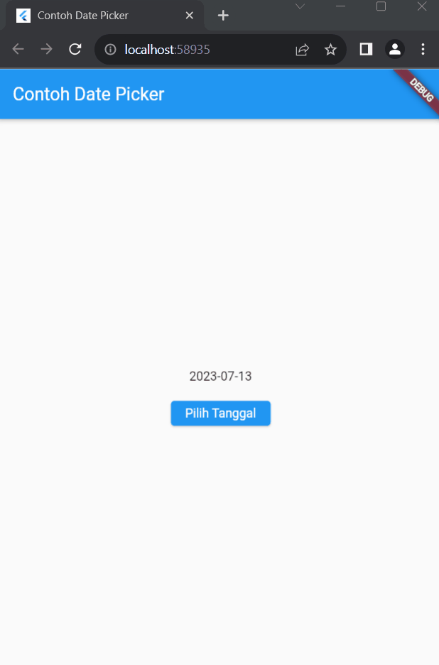


# Tugas Praktikum

1. Selesaikan Praktikum 1 sampai 4, lalu dokumentasikan dan push ke repository Anda berupa screenshot setiap hasil pekerjaan beserta penjelasannya di file README.md!
2. Pada praktikum 4 mulai dari Langkah 3 sampai 6, buatlah file widget tersendiri di folder basic_widgets, kemudian pada file main.dart cukup melakukan import widget sesuai masing-masing langkah tersebut!
3. Selesaikan Codelabs: Your first Flutter app, lalu buatlah laporan praktikumnya dan push ke repository GitHub Anda!
4. README.md berisi: capture hasil akhir tiap praktikum (side-by-side, bisa juga berupa file GIF agar terlihat proses perubahan ketika ada aksi dari pengguna) di browser dan perangkat fisik (device) dengan menampilkan NIM dan Nama Anda sebagai ciri pekerjaan Anda. Jika mode developer di perangkat HP Anda belum aktif, silakan cari di internet cara mengaktifkannya!
5. Kumpulkan berupa link repository/commit GitHub Anda ke tautan spreadsheet yang telah disepakati oleh dosen!

***Jawab***

Mengimplementasikan Praktikum 4 Langkah 3 - 6

1. Membuat file widget class alert_dialog_widget, yang berisi function untuk menampilkan alert

2. Membuat file widget class date_time_picker_widget, yang berisi function untuk menampilkan date and time picker

3. Membuat file widget class text_field_widget, yang berisi function untuk menampilkan text field

4. Import class class alert_dialog_widget, date_time_picker_widget, text_field_widget pada main.dart

``` dart
import 'basic_widgets/alert_dialog_widget.dart';
import 'basic_widgets/text_field_widget.dart';
import 'basic_widgets/date_time_picker_widget.dart';
```

5. Panggil MyTextField, AlertButton, MyDateTimePicker pada main.dart

```dart
children: <Widget>[
    MyTextField(), // TextField 
    const SizedBox(height: 20.0),
    AlertButton(),  // Button Alert
    const SizedBox(height: 20.0),
    MyDateTimePicker(), //Button DateTime
```

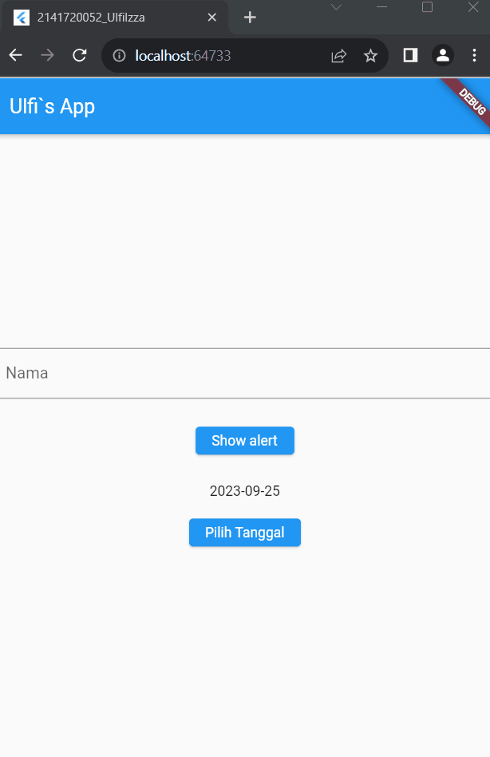