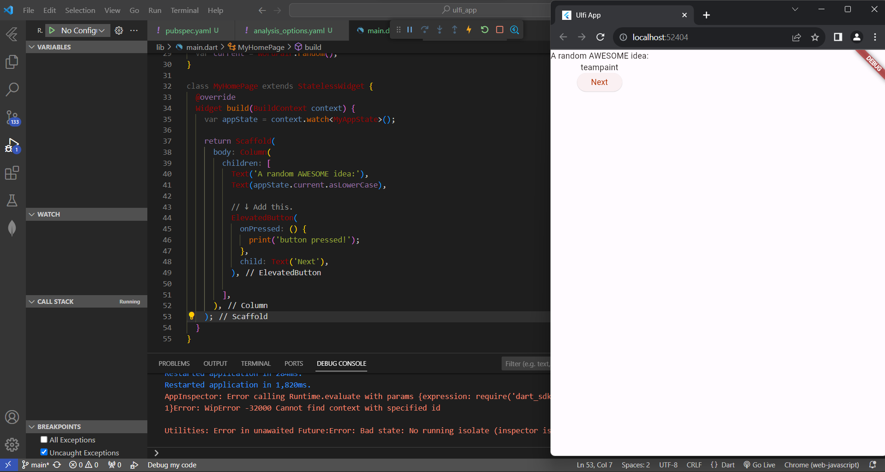

| Nama                                | Kelas | NIM        |
| ----------------------------------- | ----- | ---------- |
| Ulfi Mustatiq Abidatul Izza         | TI-3H | 2141720052 |

# TUGAS PRAKTIKUM NO 3

### Membuat Project

- Mengganti konten file pubspec.yaml

- Mengganti konten file analysis_options.yaml

- Mengganti konten file lib/main.dart

### Menambahkan Tombol

- Meluncurkan Aplikasi

Menampilkan aplikasi dalam mode debug, dengan tampilan masih biasa saja. 

- Hot Reload Pertama

Mengganti text dengan **A random AWESOME idea:**

- Menambahkan Tombol

Menambahkan tombol di bagian bawah Column, tepat di bawah instance Text kedua. Sehingga, Konsol Debug di VS Code menampilkan pesan **button pressed!**

- Kursus singkat Flutter 5 menit

- Perilaku Pertama Anda

### Memperindah Tampilan Aplikasi

- Mengekstrak widget

BigCard

- Menambahkan Kartu

Padding

Card

Hasil

- Tema dan Gaya

- TextTheme

- Meningkatkan Aksesibilitas

- Menempatkan UI di tengah

- Center

### Menambahkan Fungsi

- Menambahkan Logika Bisnis

- Menambahkan Tombol

- ElevatedButton.icon()

Menambahkan tombol kedua untuk MyHomePage dengan menggunakan ElevatedButton.icon() untuk membuat tombol dengan ikon.

### Menambahkan Kolom Samping Navigasi

- Widget Stateless Versus Stateful

- setState

- Menggunakan selectedIndex

- Tingkat Respons

### Menambahkan Halaman Baru

