| Nama                                | Kelas | NIM        |
| ----------------------------------- | ----- | ---------- |
| Ulfi Mustatiq Abidatul Izza         | TI-3H | 2141720052 |


# Basic Flutter layout concepts

## 1. Row and Column classes

```dart 
import 'dart:async';
import 'package:flutter/material.dart';
import 'package:flutter_test/flutter_test.dart';

class MyColumn extends StatelessWidget {
  const MyColumn({super.key});

  @override
  Widget build(BuildContext context) {
    return Row(
      children: [
        BlueBox(),
        BlueBox(),
        BlueBox(),
      ],
    );
  }
}

class BlueBox extends StatelessWidget {
  @override
  Widget build(BuildContext context) {
    return Container(
      width: 50,
      height: 50,
      decoration: BoxDecoration(
        color: Colors.blue,
        border: Border.all(),
      ),
    );
  }
}
```

**Hasil**

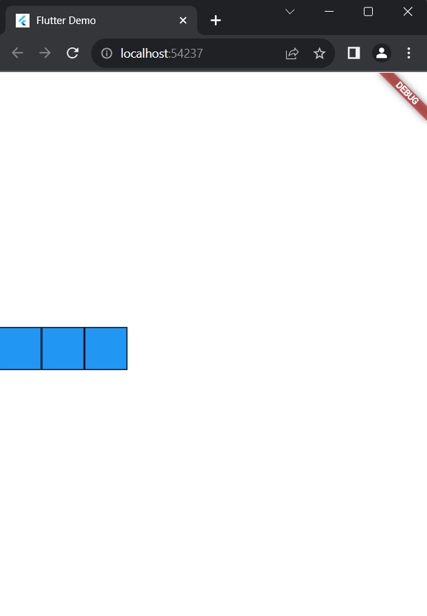

## 2. Axis size and alignment

```dart
import 'dart:async';
import 'package:flutter/material.dart';
import 'package:flutter_test/flutter_test.dart';

class MyColumn extends StatelessWidget {
  const MyColumn({super.key});

  @override
  Widget build(BuildContext context) {
    return Row(
      mainAxisSize: MainAxisSize.max,
      children: [
        BlueBox(),
        BlueBox(),
        BlueBox(),
      ],
    );
  }
}

class BlueBox extends StatelessWidget {
  @override
  Widget build(BuildContext context) {
    return Container(
      width: 50,
      height: 50,
      decoration: BoxDecoration(
        color: Colors.blue,
        border: Border.all(),
      ),
    );
  }
}
```

### mainAxisSize property

- max

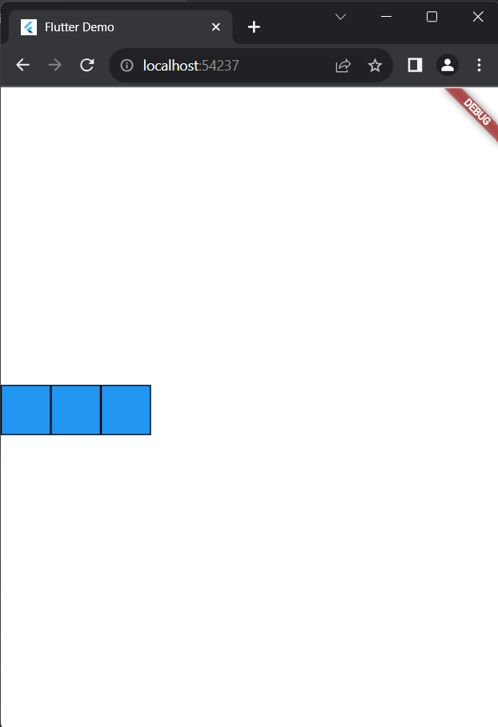

- min

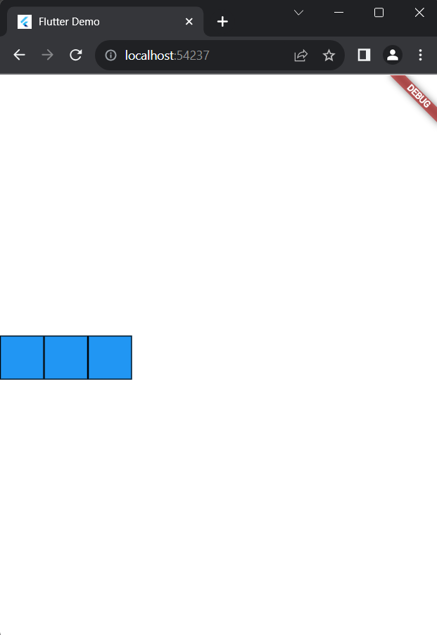

### mainAxisAlignment property

```dart
import 'dart:async';
import 'package:flutter/material.dart';
import 'package:flutter_test/flutter_test.dart';

class MyColumn extends StatelessWidget {
  const MyColumn({super.key});

  @override
  Widget build(BuildContext context) {
    return Row(
      mainAxisAlignment: MainAxisAlignment.start,
      children: [
        BlueBox(),
        BlueBox(),
        BlueBox(),
      ],
    );
  }
}

class BlueBox extends StatelessWidget {
  @override
  Widget build(BuildContext context) {
    return Container(
      width: 50,
      height: 50,
      decoration: BoxDecoration(
        color: Colors.blue,
        border: Border.all(),
      ),
    );
  }
}
```

- start


- end 

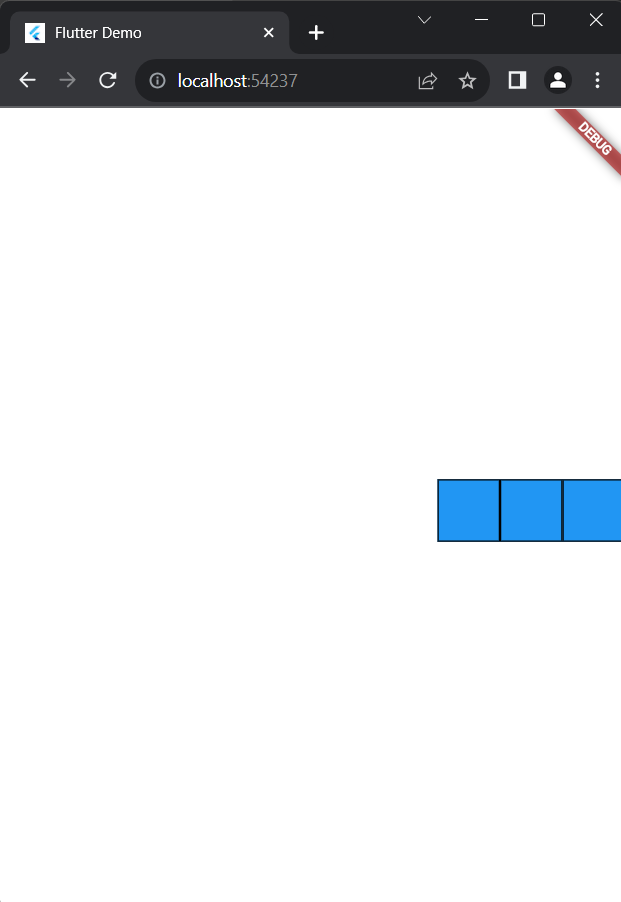

- center

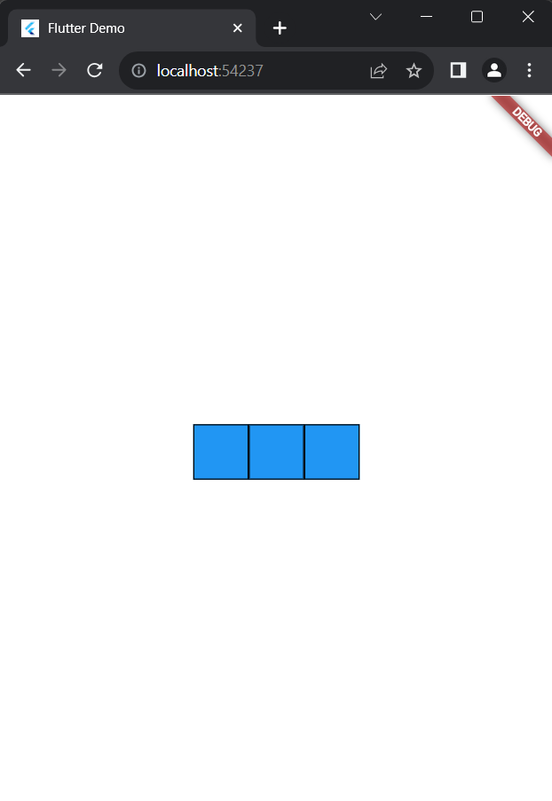

- spaceBetween

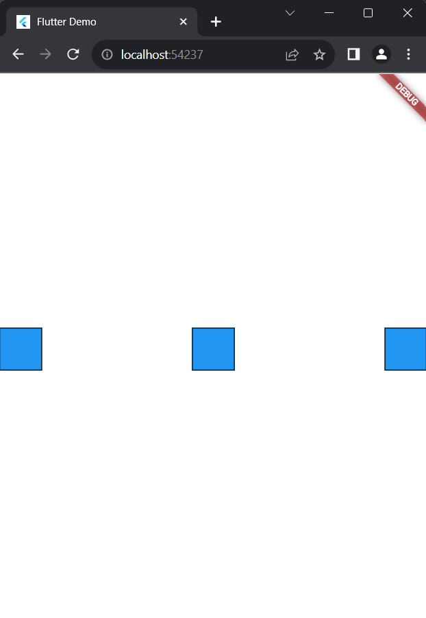

- spaceEvenly

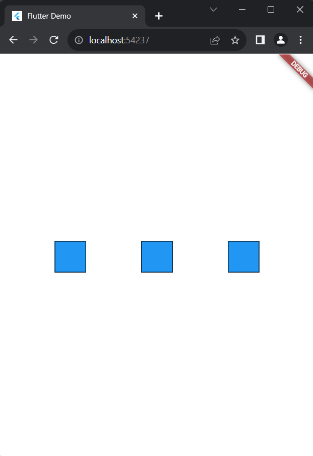

- spaceAround

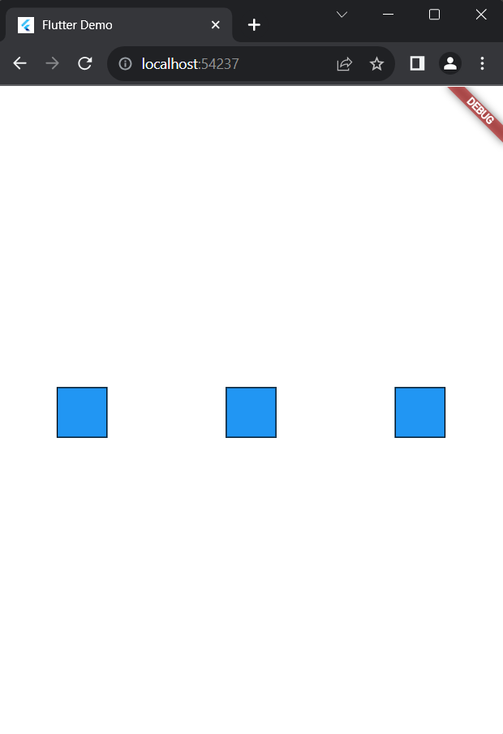

### crossAxisAlignment property

```dart
import 'dart:async';
import 'package:flutter/material.dart';
import 'package:flutter_test/flutter_test.dart';

class MyColumn extends StatelessWidget {
  const MyColumn({super.key});

  @override
  Widget build(BuildContext context) {
    return Row(
      mainAxisAlignment: MainAxisAlignment.spaceAround,
      crossAxisAlignment: CrossAxisAlignment.start,
      children: [
        BlueBox(),
        BiggerBlueBox(),
        BlueBox(),
      ],
    );
  }
}

class BlueBox extends StatelessWidget {
  @override
  Widget build(BuildContext context) {
    return Container(
      width: 50,
      height: 50,
      decoration: BoxDecoration(
        color: Colors.blue,
        border: Border.all(),
      ),
    );
  }
}

class BiggerBlueBox extends StatelessWidget {
  @override
  Widget build(BuildContext context) {
    return Container(
      width: 50,
      height: 100,
      decoration: BoxDecoration(
        color: Colors.blue,
        border: Border.all(),
      ),
    );
  }
}
```

- start

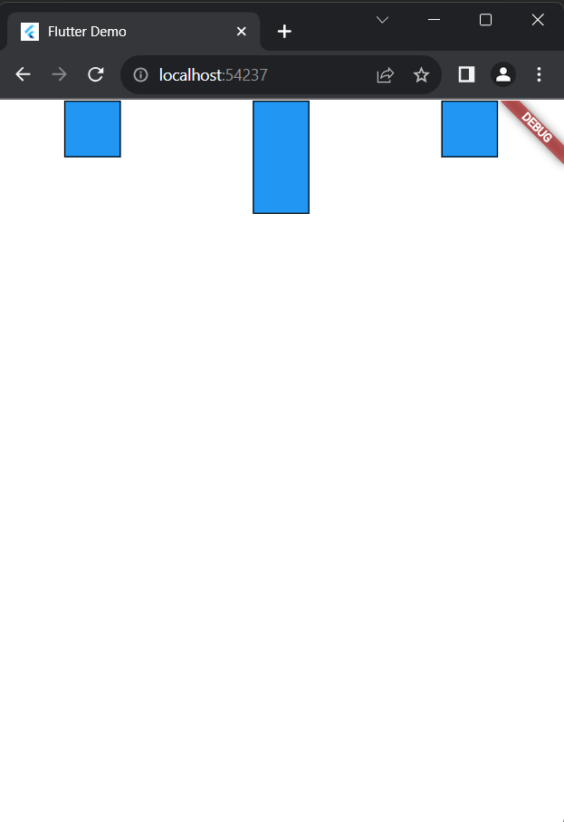

- end

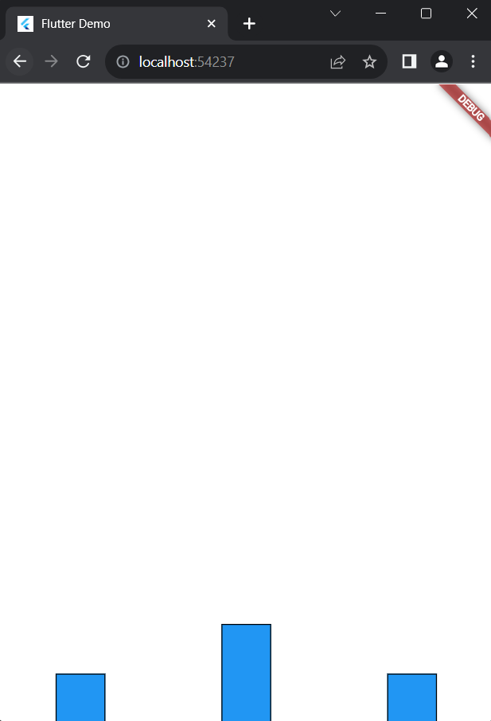

- center

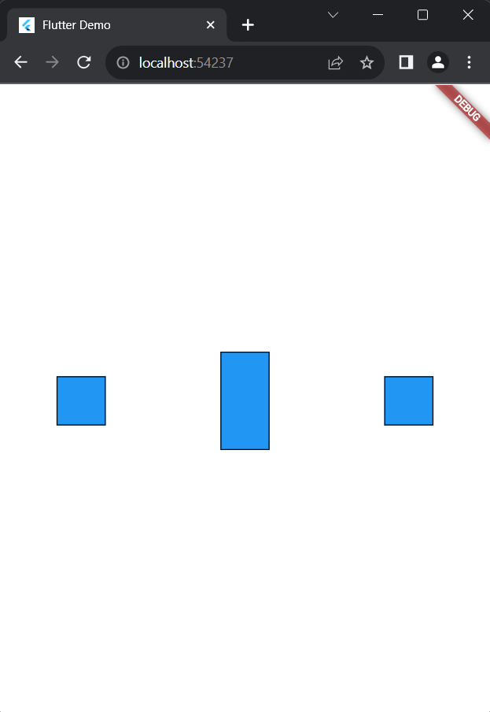

- stretch

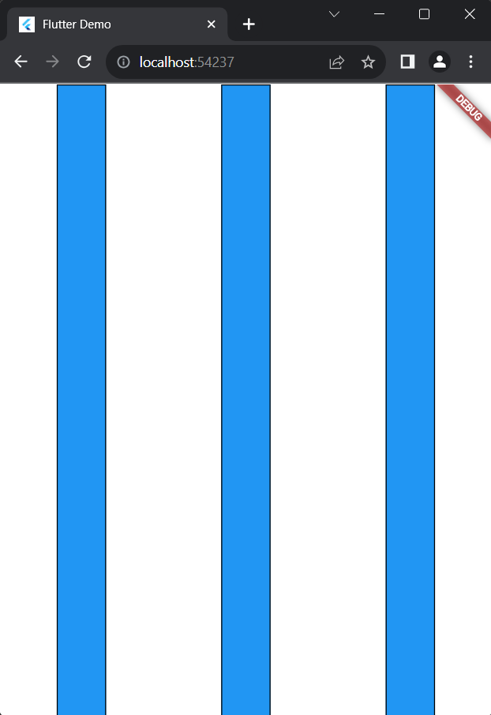

## 3. Flexible widget

```dart
import 'dart:async';
import 'package:flutter/material.dart';
import 'package:flutter_test/flutter_test.dart';

class MyColumn extends StatelessWidget {
  const MyColumn({super.key});

  @override
  Widget build(BuildContext context) {
    return Row(
      children: [
        BlueBox(),
        Flexible(
          fit: FlexFit.loose,
          flex: 1,
          child: BlueBox(),
        ),
        Flexible(
          fit: FlexFit.loose,
          flex: 1,
          child: BlueBox(),
        ),
      ],
    );
  }
}

class BlueBox extends StatelessWidget {
  @override
  Widget build(BuildContext context) {
    return Container(
      width: 50,
      height: 50,
      decoration: BoxDecoration(
        color: Colors.blue,
        border: Border.all(),
      ),
    );
  }
}
```

- loose


- tight

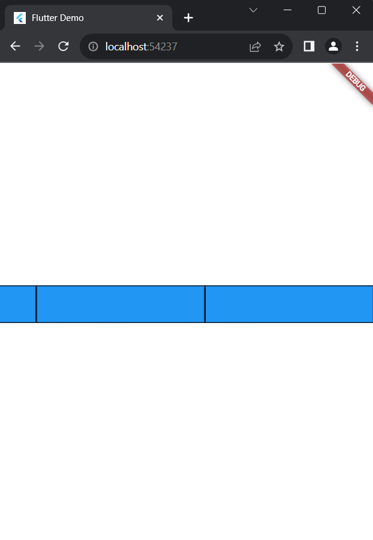

## 4. Expanded widget

```dart
import 'dart:async';
import 'package:flutter/material.dart';
import 'package:flutter_test/flutter_test.dart';

class MyColumn extends StatelessWidget {
  const MyColumn({super.key});

  @override
  Widget build(BuildContext context) {
    return Row(
      mainAxisSize: MainAxisSize.max,
      children: [
        BlueBox(),
        SizedBox(
          width: 10,
          height: 10,
          child: BlueBox(),
        ),
        BlueBox(),
      ],
    );
  }
}

class BlueBox extends StatelessWidget {
  @override
  Widget build(BuildContext context) {
    return Container(
      width: 50,
      height: 50,
      decoration: BoxDecoration(
        color: Colors.blue,
        border: Border.all(),
      ),
    );
  }
}
```

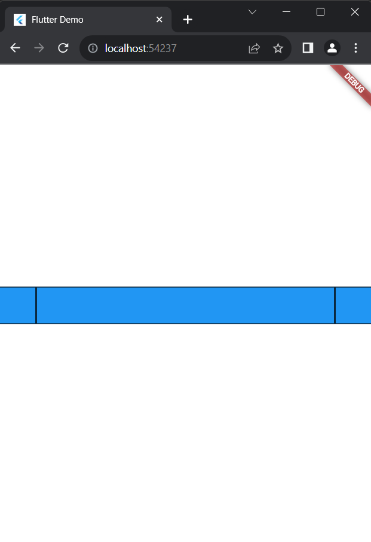

## 5. SizedBox widget

```dart
import 'dart:async';
import 'package:flutter/material.dart';
import 'package:flutter_test/flutter_test.dart';

class MyColumn extends StatelessWidget {
  const MyColumn({super.key});

  @override
  Widget build(BuildContext context) {
    return Row(
      mainAxisSize: MainAxisSize.max,
      children: [
        BlueBox(),
        SizedBox(
          width: 100,
          child: BlueBox(),
        ),
        BlueBox(),
      ],
    );
  }
}

class BlueBox extends StatelessWidget {
  @override
  Widget build(BuildContext context) {
    return Container(
      width: 50,
      height: 50,
      decoration: BoxDecoration(
        color: Colors.blue,
        border: Border.all(),
      ),
    );
  }
}
```
- Resizing a widget

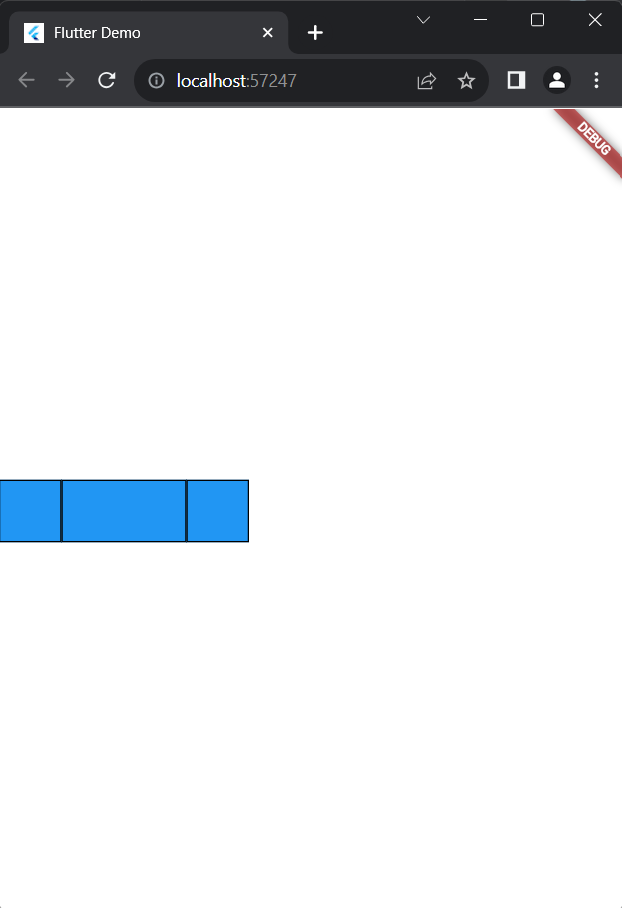

- Setelah menambahkan height 100

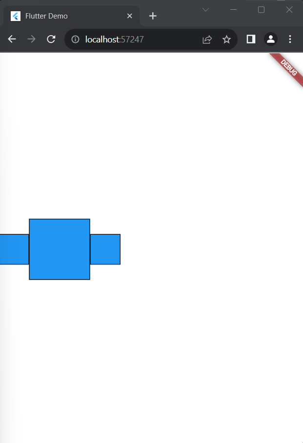

- Creating space

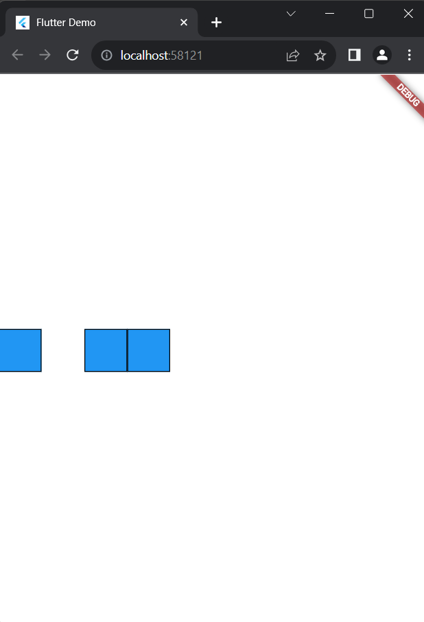

## 6. Spacer widget

```dart
import 'dart:async';
import 'package:flutter/material.dart';
import 'package:flutter_test/flutter_test.dart';

class MyColumn extends StatelessWidget {
  const MyColumn({super.key});

  @override
  Widget build(BuildContext context) {
    return Row(
      children: [
        BlueBox(),
        const Spacer(flex: 1),
        BlueBox(),
        BlueBox(),
      ],
    );
  }
}

class BlueBox extends StatelessWidget {
  @override
  Widget build(BuildContext context) {
    return Container(
      width: 50,
      height: 50,
      decoration: BoxDecoration(
        color: Colors.blue,
        border: Border.all(),
      ),
    );
  }
}
```

- Creating more space

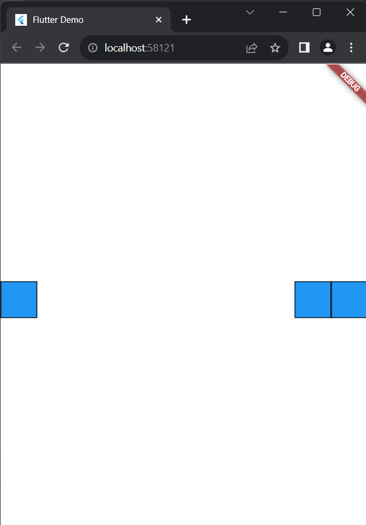

- Menambahkan spacer diantara blueboc kedua dan ketiga

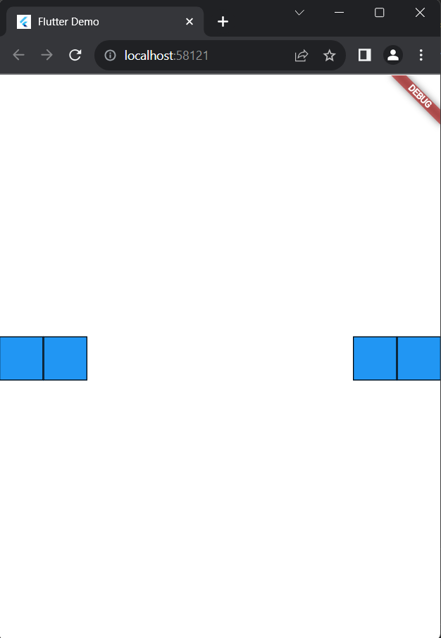

## 7. Text widget

```dart
import 'dart:async';
import 'package:flutter/material.dart';
import 'package:flutter_test/flutter_test.dart';

class MyColumn extends StatelessWidget {
  const MyColumn({super.key});

  @override
  Widget build(BuildContext context) {
    return Row(
      crossAxisAlignment: CrossAxisAlignment.baseline,
      textBaseline: TextBaseline.alphabetic,
      children: const [
        Text(
          'Hey!',
          style: TextStyle(
            fontSize: 30,
            fontFamily: 'Futura',
            color: Colors.blue,
          ),
        ),
        Text(
          'Hey!',
          style: TextStyle(
            fontSize: 50,
            fontFamily: 'Futura',
            color: Colors.green,
          ),
        ),
        Text(
          'Hey!',
          style: TextStyle(
            fontSize: 40,
            fontFamily: 'Futura',
            color: Colors.red,
          ),
        ),
      ],
    );
  }
}
```

- CrossAxisAlignment.center

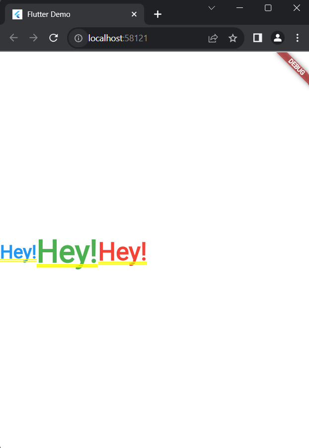

- CrossAxisAlignment.baseline

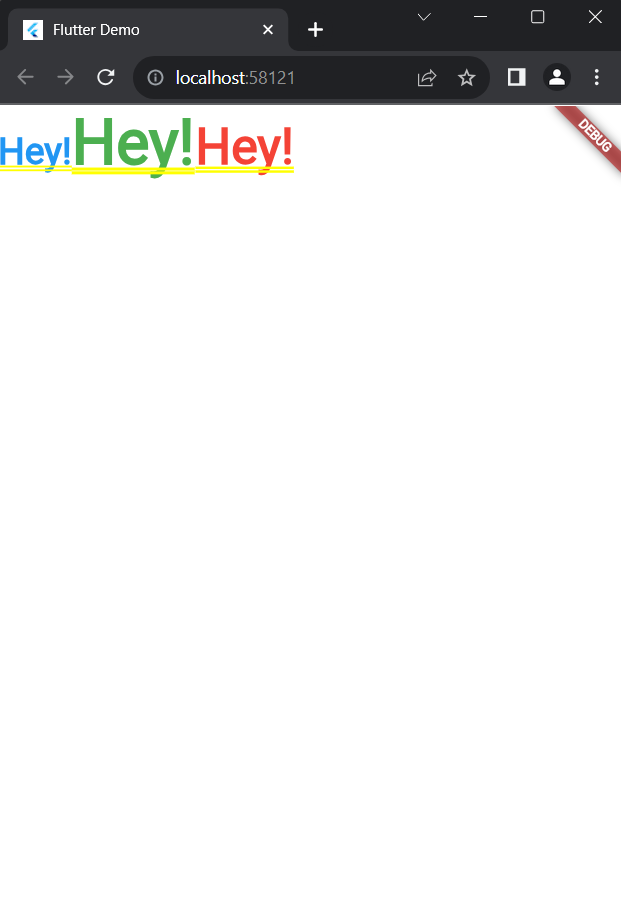

## 8. Creating an Icon

```dart
import 'dart:async';
import 'package:flutter/material.dart';
import 'package:flutter_test/flutter_test.dart';

class MyColumn extends StatelessWidget {
  const MyColumn({super.key});

  @override
  Widget build(BuildContext context) {
    return Row(
      crossAxisAlignment: CrossAxisAlignment.center,
      textBaseline: TextBaseline.alphabetic,
      children: const [
        Icon(
          Icons.widgets,
          size: 50,
          color: Colors.blue,
        ),
        Icon(
          Icons.widgets,
          size: 50,
          color: Colors.red,
        ),
      ],
    );
  }
}
```

- Colors.blue

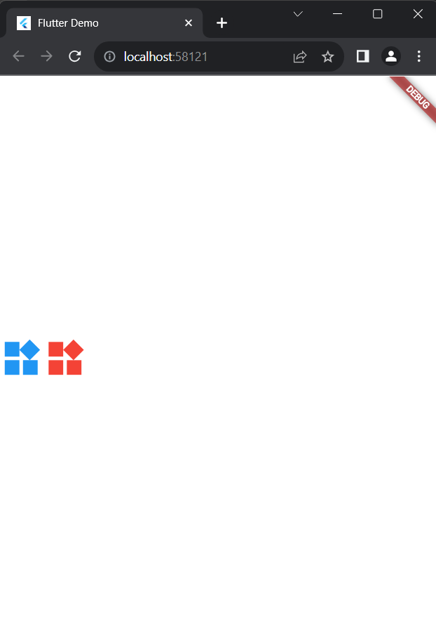

- Colors.amber

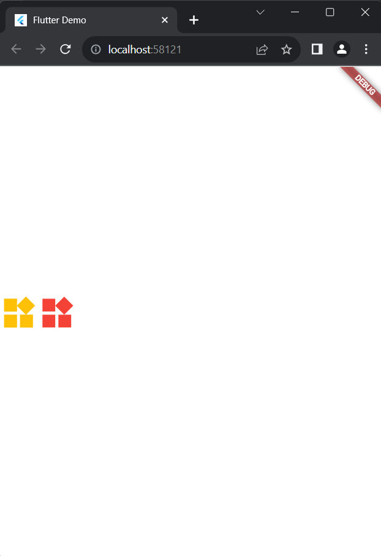

## 9. Image widget

```dart
import 'dart:async';
import 'package:flutter/material.dart';
import 'package:flutter_test/flutter_test.dart';

class MyColumn extends StatelessWidget {
  const MyColumn({super.key});

  @override
  Widget build(BuildContext context) {
    return Row(
      mainAxisAlignment: MainAxisAlignment.center,
      children: [
        Image.network('https://pbs.twimg.com/media/D0ZBld7UwAAc1sv?format=png&name=360x360'),
      ],
    );
  }
}
```

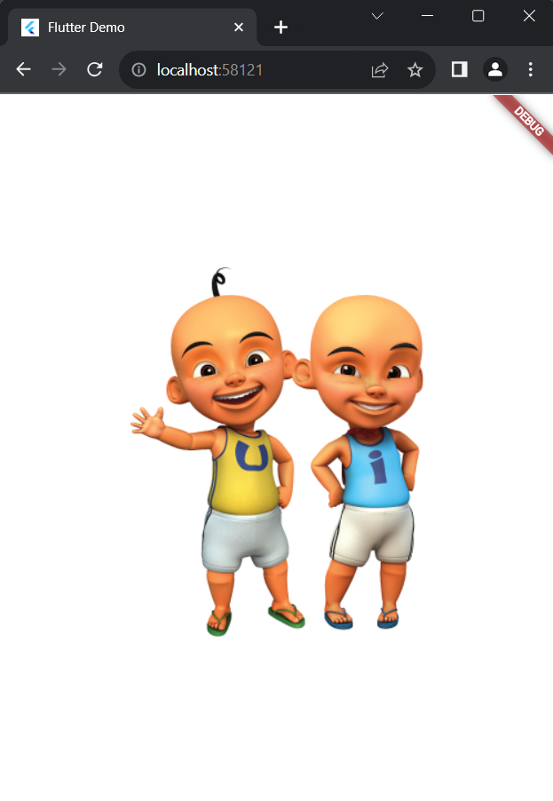