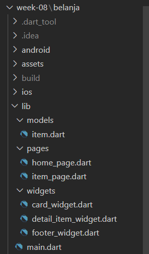

| Nama                                | No | NIM        |
| ----------------------------------- | -- | ---------- |
| Ulfi Mustatiq Abidatul Izza         | 26 | 2141720052 |

# Praktikum 5: Membangun Navigasi di Flutter

Pada praktikum 5 ini akan belajar mengenai pembangunan aplikasi bergerak multi halaman. Aplikasi yang dikembangkan berupa kasus daftar barang belanja. Pada aplikasi ini anda akan belajar untuk berpindah halaman dan mengirimkan data ke halaman lainnya. Gambaran mockup hasil akhir aplikasi dapat anda lihat pada gambar di atas (mockup dibuat sederhana, sehingga Anda mempunyai banyak ruang untuk berkreasi). Desain aplikasi menampilkan sebuah ListView widget yang datanya bersumber dari List. Ketika item ditekan, data akan dikirimkan ke halaman berikutnya.

## Langkah 1: Siapkan project baru



## Langkah 2: Mendefinisikan Route pada class home_page.dart dan item_page.dart

- home_page.dart

```dart
class HomePage extends StatelessWidget {
  final List<Item> items = [
    Item(name: 'Sugar', price: 21000, imageUrl: '../assets/sugar.jpg', stok: 51, rating: 4.3),
    Item(name: 'Salt', price: 2000, imageUrl: '../assets/salt.jpg', stok: 44, rating: 4.5),
    Item(name: 'Tepung', price: 13000, imageUrl: '../assets/tepung.jpg', stok: 44, rating: 4.7),
    Item(name: 'Minyak', price: 41000, imageUrl: '../assets/minyak.jpg', stok: 44, rating: 4.4),
    Item(name: 'Saos Sambal', price: 17500, imageUrl: '../assets/saos.jpg', stok: 44, rating: 4.6),
  ];

  @override
  Widget build(BuildContext context) {
    return Scaffold(
      appBar: AppBar(
        title: const Text('Shopping List'),
      ),
      body: GridView.builder(
        gridDelegate: const SliverGridDelegateWithFixedCrossAxisCount(
          crossAxisCount: 2,
          childAspectRatio: 0.75,
        ),
        itemCount: items.length,
        itemBuilder: (context, index) {
          final item = items[index];
          return CardWidget(item: item);
        },
      ),
      bottomNavigationBar: FooterWidget(), // Gunakan FooterWidget sebagai bottomNavigationBar
    );
  }
}
```

- item_page.dart

```dart
class ItemPage extends StatelessWidget {
  const ItemPage({Key? key}) : super(key: key);

  @override
  Widget build(BuildContext context) {
    final itemArgs = ModalRoute.of(context)!.settings.arguments as Item;

    return Scaffold(
      appBar: AppBar(
        title: const Text('Item Details'),
      ),
      body: SingleChildScrollView(
        padding: const EdgeInsets.all(16),
        child: DetailItemWidget(item: itemArgs),
      ),
    );
  }
}
```

## Langkah 3: Lengkapi Kode di main.dart


## Langkah 4: Membuat data model pada class item.dart


## Langkah 5: Membuat Widget

- card_widget.dart

```dart
class CardWidget extends StatelessWidget {
  final Item item;

  const CardWidget({required this.item, Key? key}) : super(key: key);

  @override
  Widget build(BuildContext context) {
    return InkWell(
      onTap: () {
        Navigator.pushNamed(context, '/item', arguments: item);
      },
      child: Card(
        child: Padding(
          padding: const EdgeInsets.all(8),
          child: Column(
            crossAxisAlignment: CrossAxisAlignment.start,
            children: [
              Hero(
                tag: 'productImage${item.name}',
                child: AspectRatio(
                  aspectRatio: 1,
                  child: Image.asset(item.imageUrl, fit: BoxFit.cover),
                ),
              ),
              Row(
                mainAxisAlignment: MainAxisAlignment.spaceBetween,
                children: [
                  Padding(
                    padding: const EdgeInsets.only(top: 8),
                    child: Text(
                      item.name,
                      style: const TextStyle(
                        fontWeight: FontWeight.bold,
                        fontSize: 16,
                      ),
                    ),
                  ),
                  Row(
                    children: [
                      const Icon(
                        Icons.star,
                        color: Colors.orange,
                        size: 20,
                      ),
                      Text(
                        item.rating.toString(),
                        style: const TextStyle(
                          color: Colors.orange,
                          fontSize: 14,
                        ),
                      ),
                    ],
                  ),
                ],
              ),
              Text(
                'Rp. ${item.price}',
                style: const TextStyle(
                  color: Colors.redAccent,
                  fontSize: 14,
                ),
              ),
              Padding(
                padding: const EdgeInsets.symmetric(vertical: 8),
                child: Text(
                  'Stok: ${item.stok}',
                  style: const TextStyle(
                    color: Colors.grey,
                    fontSize: 14,
                  ),
                ),
              ),
            ],
          ),
        ),
      ),
    );
  }
}
```

- detail_item_widget.dart

```dart
class DetailItemWidget extends StatelessWidget {
  final Item item;

  const DetailItemWidget({required this.item, Key? key}) : super(key: key);

  @override
  Widget build(BuildContext context) {
    return Column(
      crossAxisAlignment: CrossAxisAlignment.start,
      children: [
        Hero(
          tag: 'productImage${item.name}',
          child: AspectRatio(
            aspectRatio: 1.5,
            child: Image.asset(item.imageUrl),
          ),
        ),
        const SizedBox(height: 16),
        Text(
          '${item.name}',
          style: const TextStyle(
            fontWeight: FontWeight.bold,
            fontSize: 24,
          ),
        ),
        const SizedBox(height: 8),
        Row(
          mainAxisAlignment: MainAxisAlignment.spaceBetween,
          children: [
            Text(
              'Rp. ${item.price}',
              style: const TextStyle(
                color: Colors.deepOrange,
                fontSize: 20,
              ),
            ),
            Row(
              children: [
                const Icon(
                  Icons.star,
                  color: Colors.orange,
                  size: 20,
                ),
                Text(
                  item.rating.toString(),
                  style: const TextStyle(
                    color: Colors.orange,
                    fontSize: 16,
                  ),
                ),
              ],
            ),
          ],
        ),
        const SizedBox(height: 8),
        Text(
          'Stok: ${item.stok}',
          style: const TextStyle(
            color: Colors.grey,
            fontSize: 16,
          ),
        ),
      ],
    );
  }
}
```

- footer_widget.dart

```dart
class FooterWidget extends StatelessWidget {
  const FooterWidget({Key? key}) : super(key: key);

  @override
  Widget build(BuildContext context) {
    return Container(
      decoration: BoxDecoration(
        color: Colors.blue,
        borderRadius: BorderRadius.only(
          topLeft: Radius.circular(15),
          topRight: Radius.circular(15),
        ),
      ),
      child: Row(
        mainAxisAlignment: MainAxisAlignment.spaceBetween,
        children: [
          Padding(
            padding: const EdgeInsets.all(16),
            child: Text(
              'Nama: Ulfi Mustatiq Abidatul Izza',
              style: TextStyle(
                color: Colors.white,
                fontSize: 16,
              ),
            ),
          ),
          Padding(
            padding: const EdgeInsets.all(16),
            child: Text(
              'NIM: 2141720052',
              style: TextStyle(
                color: Colors.white,
                fontSize: 16,
              ),
            ),
          ),
        ],
      ),
    );
  }
}
```

# Tugas Praktikum

1. Untuk melakukan pengiriman data ke halaman berikutnya, cukup menambahkan informasi arguments pada penggunaan Navigator. Perbarui kode pada bagian Navigator menjadi seperti berikut.

```dart
Navigator.pushNamed(context, '/item', arguments: item);
```


2. Pembacaan nilai yang dikirimkan pada halaman sebelumnya dapat dilakukan menggunakan ModalRoute. Tambahkan kode berikut pada blok fungsi build dalam halaman ItemPage. Setelah nilai didapatkan, anda dapat menggunakannya seperti penggunaan variabel pada umumnya. (https://docs.flutter.dev/cookbook/navigation/navigate-with-arguments)

```dart
final itemArgs = ModalRoute.of(context)!.settings.arguments as Item;
```

3. Pada hasil akhir dari aplikasi belanja yang telah anda selesaikan, tambahkan atribut foto produk, stok, dan rating. Ubahlah tampilan menjadi GridView seperti di aplikasi marketplace pada umumnya.

4. Silakan implementasikan Hero widget pada aplikasi belanja Anda dengan mempelajari dari sumber ini: https://docs.flutter.dev/cookbook/navigation/hero-animations

5. Sesuaikan dan modifikasi tampilan sehingga menjadi aplikasi yang menarik. Selain itu, pecah widget menjadi kode yang lebih kecil. Tambahkan Nama dan NIM di footer aplikasi belanja Anda.

6. Selesaikan Praktikum Navigasi dan Rute tersebut, lalu dokumentasikan dan push ke repository Anda berupa screenshot setiap hasil pekerjaan beserta penjelasannya di file README.md. Kumpulkan link commit repository GitHub Anda ke spreadsheet yang telah disediakan!

## **Hasil Tampilan Akhir**

