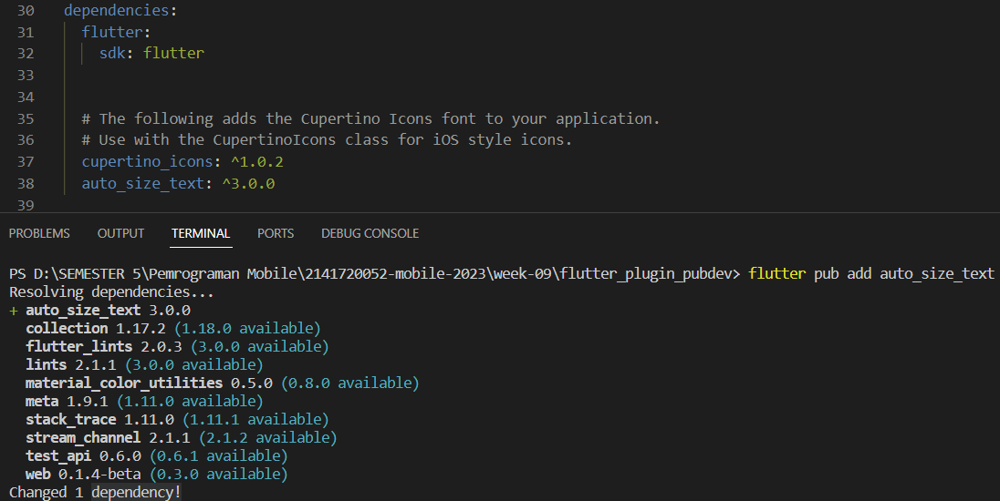
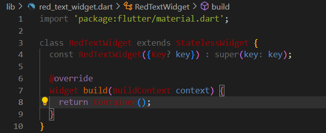
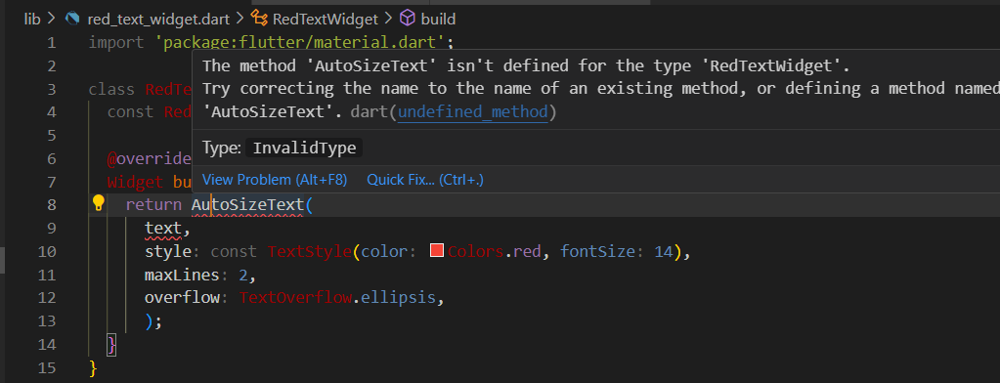
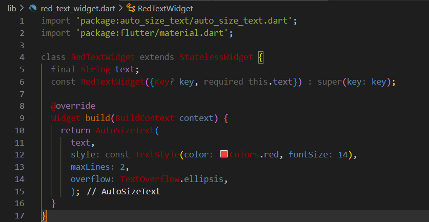
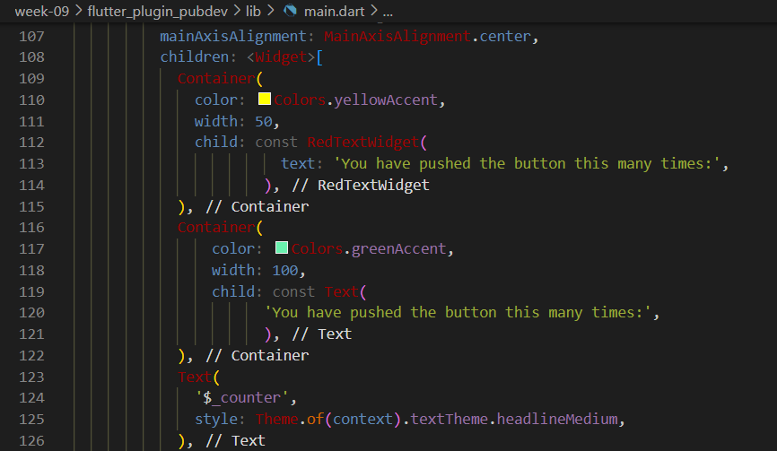
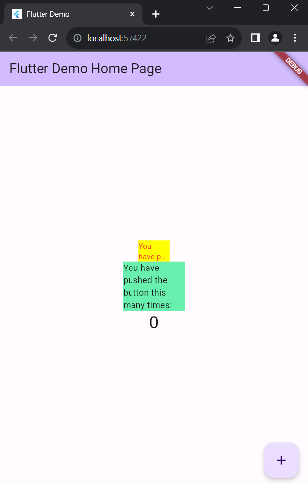

| Nama                                | No | NIM        |
| ----------------------------------- | -- | ---------- |
| Ulfi Mustatiq Abidatul Izza         | 26 | 2141720052 |

# **Praktikum Menerapkan Plugin di Project Flutter**

## Langkah 1: Buat Project Baru

Membuat sebuah project flutter baru dengan nama flutter_plugin_pubdev.

## Langkah 2: Menambahkan Plugin

Menambahkan plugin auto_size_text



## Langkah 3: Buat file red_text_widget.dart

Buat file baru bernama red_text_widget.dart di dalam folder lib



## Langkah 4: Tambah Widget AutoSizeText

Masih di file red_text_widget.dart, untuk menggunakan plugin auto_size_text, ubahlah kode return Container() menjadi seperti berikut



## Langkah 5: Buat Variabel text dan parameter di constructor

Tambahkan variabel text dan parameter di constructor seperti berikut.



## Langkah 6: Tambahkan widget di main.dart

Buka file main.dart lalu tambahkan di dalam children: pada class _MyHomePageState



**Hasil Tampilan**



## **Tugas Praktikum**

### 1. Selesaikan Praktikum tersebut, lalu dokumentasikan dan push ke repository Anda berupa screenshot hasil pekerjaan beserta penjelasannya di file README.md!
### 2. Jelaskan maksud dari langkah 2 pada praktikum tersebut!

### ***Jawab:***

Perintah yang diberikan, yaitu **flutter pub add auto_size_text**, digunakan untuk menambahkan plugin "auto_size_text" ke project flutter_plugin_pubdev menggunakan manajer paket pub. Plugin ini, digunakan untuk mengatur ukuran teks secara otomatis agar sesuai dengan ukuran layar perangkat pengguna. Ini berguna untuk memastikan teks tetap terlihat dengan baik dan mudah dibaca.

### 3. Jelaskan maksud dari langkah 5 pada praktikum tersebut!

### ***Jawab:***

Pada langkah 5 pada praktikum tersebut mengharuskan Anda untuk mengganti kode return Container() dalam file red_text_widget.dart dengan kode yang menggunakan widget AutoSizeText dari plugin "auto_size_text". Ini bertujuan untuk memanfaatkan plugin tersebut dalam project untuk mengatur ukuran teks secara otomatis dan membatasi teks ke maksimal 2 baris dengan tanda elipsis jika terlalu panjang.

Namun setelah menambahkan kode tersebut terdapat error:
- Terdapat error pada *AutoSizeText* yang disebabkan karena belum menambahkan import package auto_size_text di file red_text_widget.dart dengan benar, maka perlu menambahkan import:
```dart
import 'package:auto_size_text/auto_size_text.dart';
```

- Juga terdapat error pada *text* yang disebabkan karena tidak ada tipe data dari variabel text sesuai dengan yang diharapkan oleh AutoSizeText, maka harus menambahkan kode dengan:
```dart
final String text;
```

### 4. Pada langkah 6 terdapat dua widget yang ditambahkan, jelaskan fungsi dan perbedaannya!

### ***Jawab***

Pada langkah 6, menambahkan dua widget ke dalam widget tree dalam file main.dart. Berikut penjelasan tentang fungsi dan perbedaan kedua widget tersebut:

a. Container dengan RedTextWidget:

- Fungsi: Widget ini menggunakan Container dengan latar belakang kuning dan berisi widget RedTextWidget. RedTextWidget adalah teks berwarna merah yang dapat menyesuaikan ukuran teks secara otomatis dengan plugin "auto_size_text". Teks yang ditampilkan adalah 'You have pushed the button this many times:'.
- Perbedaan: Menggunakan teks yang lebih dinamis yang bisa menyesuaikan ukuran dengan plugin "auto_size_text".

b. Container dengan Text:

- Fungsi: Widget ini juga menggunakan Container dengan latar belakang hijau dan berisi widget Text. Teks yang ditampilkan adalah statis, yaitu 'You have pushed the button this many times:'.
- Perbedaan: Teks adalah statis, tidak menyesuaikan ukuran otomatis, dan tidak menggunakan plugin "auto_size_text".

### 5. Jelaskan maksud dari tiap parameter yang ada di dalam plugin auto_size_text berdasarkan tautan pada dokumentasi ini !

### ***Jawab***

Berikut adalah daftar parameter yang tersedia dalam plugin "auto_size_text" berserta penjelasan fungsinya:

| Parameter            | Fungsi                                                           |
|----------------------|------------------------------------------------------------------|
| key                  | Mengontrol penggantian widget dalam pohon widget (widget tree).  |
| textKey              | Menentukan kunci (key) untuk widget teks (Text) yang dihasilkan. |
| style                | Menentukan gaya (style) yang akan digunakan untuk teks tersebut jika tidak null. |
| minFontSize          | Batasan ukuran teks minimum saat menyesuaikan ukuran teks secara otomatis (diabaikan jika ada pengaturan "presetFontSizes"). |
| maxFontSize          | Batasan ukuran teks maksimum saat menyesuaikan ukuran teks secara otomatis (diabaikan jika ada pengaturan "presetFontSizes"). |
| stepGranularity      | Ukuran langkah di mana ukuran font disesuaikan dengan batasan. |
| presetFontSizes      | Mendefinisikan semua ukuran font yang mungkin sebelumnya (harus dalam urutan menurun). |
| group                | Mensinkronkan ukuran dari beberapa AutoSizeText.               |
| textAlign            | Menentukan cara teks akan diatur secara horizontal.            |
| textDirection        | Menentukan arah teks, memengaruhi cara nilai textAlign seperti TextAlign.start dan TextAlign.end diinterpretasikan. |
| locale               | Digunakan untuk memilih font ketika karakter Unicode yang sama dapat dirender dengan cara yang berbeda tergantung pada wilayah (locale) tertentu. |
| softWrap             | Menentukan apakah teks harus mematahkan baris pada pemisah baris yang lembut. |
| wrapWords            | Menentukan apakah kata-kata yang tidak muat dalam satu baris harus dibungkus. Secara default, bernilai true untuk menyerupai perilaku widget Text. |
| overflow             | Menentukan bagaimana penanganan tampilan yang berlebihan (overflow) harus dilakukan. |
| overflowReplacement  | Jika teks meluap (overflow) dan tidak muat dalam batasnya, widget ini akan ditampilkan sebagai pengganti. |
| textScaleFactor      | Menentukan jumlah piksel font untuk setiap piksel logis. Juga memengaruhi minFontSize, maxFontSize, dan presetFontSizes. |
| maxLines             | Menentukan jumlah maksimum baris teks yang ditampilkan. |
| semanticsLabel       | Label semantik alternatif untuk teks ini.                       |
