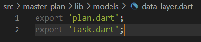
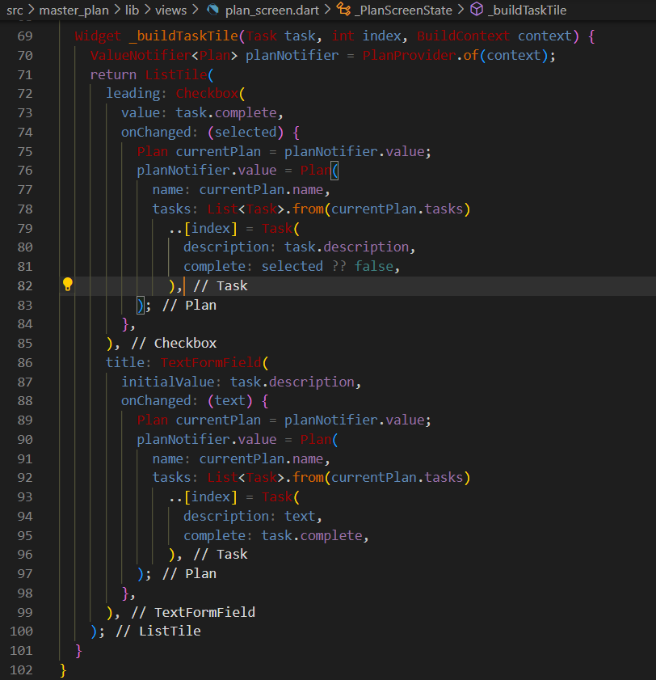

| Nama                                | No | NIM        |
| ----------------------------------- | -- | ---------- |
| Ulfi Mustatiq Abidatul Izza         | 26 | 2141720052 |

# Praktikum 1: Dasar State dengan Model-View

### Langkah 1: Buat Project Baru

### Langkah 2: Membuat model task.dart

### Langkah 3: Buat file plan.dart

### Langkah 4: Buat file data_layer.dart

### Langkah 5: Pindah ke file main.dart

### Langkah 6: buat plan_screen.dart

### Langkah 7: buat method _buildAddTaskButton()
beberapa error di langkah 6, karena method yang belum dibuat. Ayo kita buat mulai dari yang paling mudah yaitu tombol Tambah Rencana. Tambah kode berikut di bawah method build di dalam class _PlanScreenState.

### Langkah 8: buat widget _buildList()

### Langkah 9: buat widget _buildTaskTile

### Langkah 10: Tambah Scroll Controller

### Langkah 11: Tambah Scroll Listener

### Langkah 12: Tambah controller dan keyboard behavior

### Langkah 13: Terakhir, tambah method dispose()

### Langkah 14: Hasil

# **Tugas Praktikum 1: Dasar State dengan Model-View**

1. Selesaikan langkah-langkah praktikum tersebut, lalu dokumentasikan berupa GIF hasil akhir praktikum beserta penjelasannya di file README.md! Jika Anda menemukan ada yang error atau tidak berjalan dengan baik, silakan diperbaiki.

2. Jelaskan maksud dari langkah 4 pada praktikum tersebut! Mengapa dilakukan demikian?

*Jawab:*

Langkah 4 pada praktikum tersebut bertujuan untuk membungkus atau mengelompokkan model-model yang terkait ke dalam satu file agar lebih terorganisir. Haln ini dilakukan dengan tujuan untuk:

- Dengan mengelompokkan model-model terkait dalam satu file, struktur kode akan menjadi lebih terorganisir. Ini membuatnya lebih mudah untuk mengelola dan mencari model ketika proyek berkembang.

- Dengan adanya file `data_layer.dart` yang mengekspor model-model tersebut, cukup dengan mengimpor file tersebut ketika model-model dibutuhkan sehingga, mengurangi jumlah import yang perlu ditulis di setiap file yang menggunakan model-model tersebut.

3. Mengapa perlu variabel plan di langkah 6 pada praktikum tersebut? Mengapa dibuat konstanta ?

*Jawab:*

Variabel **plan** pada langkah 6 digunakan untuk menyimpan dan melacak data rencana atau "plan" yang ditampilkan di layar. Penggunaan konstruktor const pada inisialisasi variabel **plan** membuat objek tersebut konstan, memastikan konsistensi data dan kontrol yang baik terhadap state aplikasi terkait. Dengan variabel ini, kita dapat mengelola informasi rencana dengan jelas dan aman di seluruh widget.

4. Lakukan capture hasil dari Langkah 9 berupa GIF, kemudian jelaskan apa yang telah Anda buat!

*Jawab:*

Membuat to do list secara dinamis

5. Apa kegunaan method pada Langkah 11 dan 13 dalam lifecyle state ?

*Jawab:*

- Langkah 11 - Metode initState():
digunakan untuk inisialisasi state saat widget dibuat. Dalam hal ini, membuat ScrollController dan menambahkan listener untuk menghilangkan fokus saat terjadi perubahan posisi scroll, membantu menangani masalah keyboard yang tidak tertutup setelah scroll.

- Langkah 13 - Metode dispose():
digunakan untuk membersihkan hal-hal yang tidak diperlukan oleh widget sebelum widget tersebut dihapus. Pada langkah ini, pastikan bahwa ScrollController dibersihkan untuk menghindari masalah memori dan lakukan pembersihan lainnya sebelum widget dihapus.

6. Kumpulkan laporan praktikum Anda berupa link commit atau repository GitHub ke spreadsheet yang telah disediakan!

# Praktikum 2: Mengelola Data Layer dengan InheritedWidget dan InheritedNotifier

### Langkah 1: Buat file plan_provider.dart

### Langkah 2: Edit main.dart

### Langkah 3: Tambah method pada model plan.dart

### Langkah 4: Pindah ke PlanScreen

### Langkah 5: Edit method _buildAddTaskButton

### Langkah 6: Edit method _buildTaskTile

### Langkah 7: Edit _buildList

### Langkah 8: Tetap di class PlanScreen

### Langkah 9: Tambah widget SafeArea

**Hasil**

# **Tugas Praktikum 2: InheritedWidget**

1. Selesaikan langkah-langkah praktikum tersebut, lalu dokumentasikan berupa GIF hasil akhir praktikum beserta penjelasannya di file README.md! Jika Anda menemukan ada yang error atau tidak berjalan dengan baik, silakan diperbaiki sesuai dengan tujuan aplikasi tersebut dibuat.

2. Jelaskan mana yang dimaksud InheritedWidget pada langkah 1 tersebut! Mengapa yang digunakan InheritedNotifier?

*Jawab:*

InheritedWidget adalah konsep Flutter yang memungkinkan berbagi data di seluruh pohon widget. Pada langkah 1, **PlanProvider** adalah turunan dari **InheritedNotifier<ValueNotifier<Plan>>**, yang memberikan cara efisien untuk mendistribusikan dan mengelola perubahan data Plan di aplikasi Flutter. 

**ValueNotifier** digunakan sebagai objek notifikasi perubahan yang dapat diakses di seluruh pohon widget. Dengan demikian, PlanProvider memanfaatkan kekuatan InheritedWidget dan ValueNotifier untuk mengelola state dan notifikasi perubahan secara efisien di seluruh aplikasi.

3. Jelaskan maksud dari method di langkah 3 pada praktikum tersebut! Mengapa dilakukan demikian?

*Jawab:*

Langkah 3 menambahkan dua metode di dalam model class Plan, yaitu completedCount dan completenessMessage. Berikut adalah penjelasan singkat:

- **completedCount**: Metode ini menghitung jumlah tugas yang telah selesai dalam objek **Plan**. Ini memberikan cara yang efisien untuk mendapatkan informasi tersebut tanpa perlu mengakses atribut-atribut langsung.

- **completenessMessage**: Metode ini mengembalikan pesan kemajuan dalam format string, menyajikan informasi seberapa banyak tugas yang telah selesai dari total tugas dalam objek **Plan**. Metode ini berguna untuk menyajikan informasi kemajuan dengan cara yang mudah ditampilkan dalam antarmuka pengguna.

Penambahan metode-metode ini membuat kelas Plan lebih mudah digunakan, meningkatkan keterbacaan kode, dan menyediakan informasi yang berguna untuk ditampilkan dalam aplikasi.

4. Lakukan capture hasil dari Langkah 9 berupa GIF, kemudian jelaskan apa yang telah Anda buat!

*Jawab:*

Dari proses sebelumnya menambahkan method untuk menampilkan progress pada bagian bawah (footer) secara dinamis.

5. Kumpulkan laporan praktikum Anda berupa link commit atau repository GitHub ke spreadsheet yang telah disediakan!

# Praktikum 3: Membuat State di Multiple Screens

### Langkah 1: Edit PlanProvider

### Langkah 2: Edit main.dart

### Langkah 3: Edit plan_screen.dart

### Langkah 4: Error

Itu akan terjadi error setiap kali memanggil PlanProvider.of(context). Itu terjadi karena screen saat ini hanya menerima tugas-tugas untuk satu kelompok Plan, tapi sekarang PlanProvider menjadi list dari objek plan tersebut.

### Langkah 5: Tambah getter Plan

### Langkah 6: Method initState()

### Langkah 7: Widget build

### Langkah 8: Edit _buildTaskTile

### Langkah 9: Buat screen baru

### Langkah 10: Pindah ke class _PlanCreatorScreenState

### Langkah 11: Pindah ke method build

### Langkah 12: Buat widget _buildListCreator

### Langkah 13: Buat void addPlan()

### Langkah 14: Buat widget _buildMasterPlans()

# **Tugas Praktikum 3: State di Multiple Screens**

1. Selesaikan langkah-langkah praktikum tersebut, lalu dokumentasikan berupa GIF hasil akhir praktikum beserta penjelasannya di file README.md! Jika Anda menemukan ada yang error atau tidak berjalan dengan baik, silakan diperbaiki sesuai dengan tujuan aplikasi tersebut dibuat.

2. Berdasarkan Praktikum 3 yang telah Anda lakukan, jelaskan maksud dari gambar diagram berikut ini!

*Jawab:*

Dari gambar diagram diatas saya dapat menyimpulkan bahwa:

a. **MaterialApp**: widget utama yang menyediakan kerangka aplikasi Flutter. Ini mencakup semua layar dan manajemen navigasi.

b. **PlanProvider**: class yang memperluas **InheritedNotifier<ValueNotifier<List<Plan>>>** untuk menyediakan notifikasi perubahan kepada widget turunannya. Ini berperan sebagai penyedia data untuk semua widget turunannya.

c. **PlanCreatorScreen**: layar pertama yang diinisialisasi oleh **MaterialApp**. Ini memiliki UI yang mencakup **TextField** untuk menambahkan rencana baru dan **ListView** untuk menampilkan daftar rencana yang ada.

- **_buildListCreator()**: widget yang membangun antarmuka pengguna untuk menambahkan rencana baru menggunakan TextField.

- **_buildMasterPlans()**: widget yang membangun daftar rencana yang sudah ada menggunakan ListView. Jika tidak ada rencana, itu menampilkan pesan bahwa pengguna belum memiliki rencana apa pun.

- **addPlan()**: method untuk menangani penambahan rencana baru ketika pengguna menekan tombol "Done" pada keyboard.

d. **PlanScreen**: layar kedua yang diakses ketika pengguna mengetuk salah satu rencana pada PlanCreatorScreen.

- **_PlanScreenState**: Kelas state untuk PlanScreen. Ini memiliki **ScrollController** untuk mengontrol **ListView**, dan memiliki **currentPlan** untuk menyimpan rencana yang sedang ditampilkan.

- **_buildList()**: widget yang membangun daftar tugas dari rencana saat ini menggunakan **ListView.builder**.

- **_buildAddTaskButton()**: widget untuk menambahkan tugas baru ke dalam rencana saat ini menggunakan tombol tindakan mengambang (FloatingActionButton).

- **_buildTaskTile()**: widget untuk membangun item tugas di dalam daftar tugas menggunakan **ListTile**.

- **initState()**: method yang dipanggil saat objek state pertama kali dibuat.

- **build()**: method untuk membangun antarmuka pengguna **PlanScreen**. Ini menggunakan **ValueListenableBuilder** untuk memperbarui tampilan ketika ada perubahan pada data rencana.

Diagram ini mencerminkan struktur dasar aplikasi dengan dua layar utama, **PlanCreatorScreen** untuk membuat dan menampilkan rencana, dan **PlanScreen** untuk menampilkan tugas dalam suatu rencana. Perubahan pada data rencana dikelola oleh **PlanProvider**, dan setiap layar memiliki hubungan yang sesuai dengan manajemen state dan navigasi.

3. Lakukan capture hasil dari Langkah 14 berupa GIF, kemudian jelaskan apa yang telah Anda buat!

*Jawab:*

4. Kumpulkan laporan praktikum Anda berupa link commit atau repository GitHub ke spreadsheet yang telah disediakan!