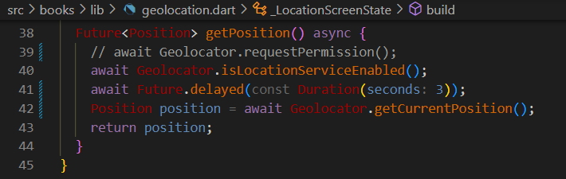
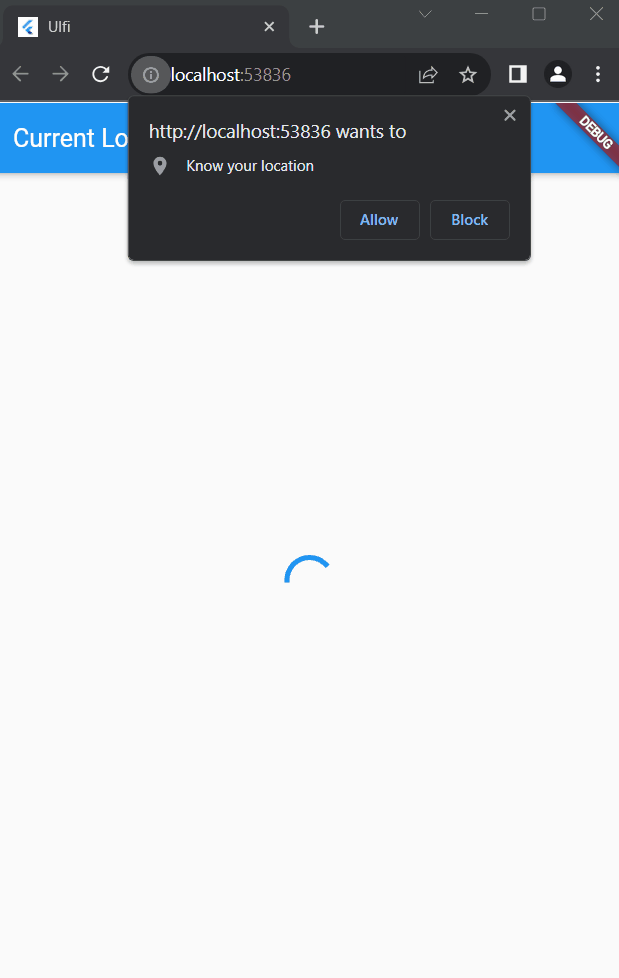
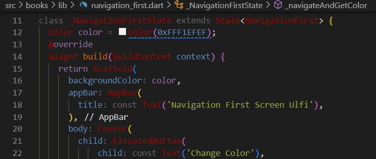
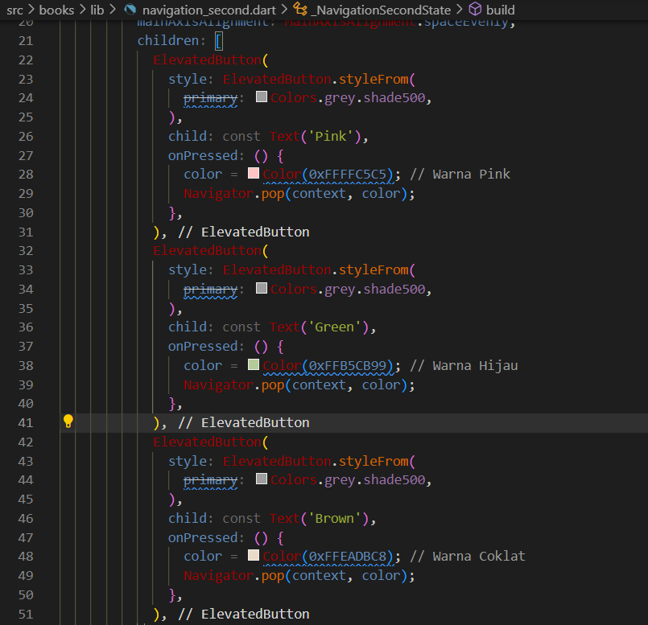
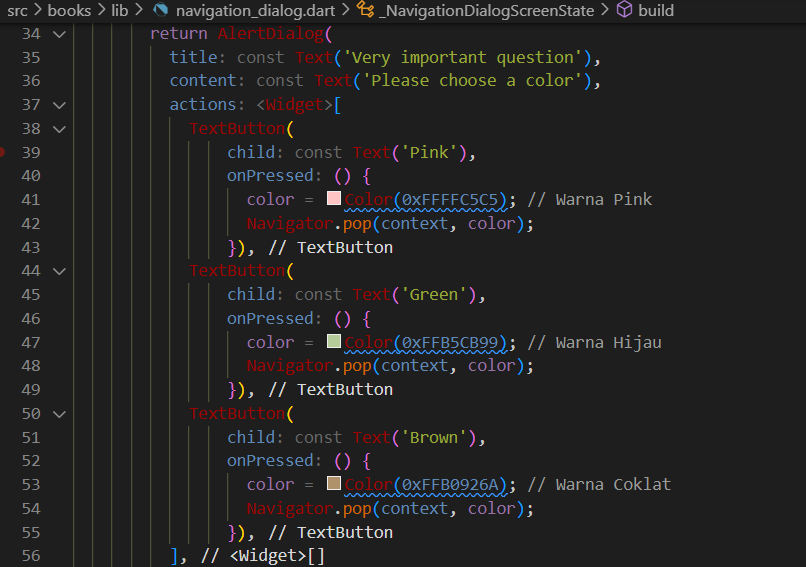

| Nama                                | No | NIM        |
| ----------------------------------- | -- | ---------- |
| Ulfi Mustatiq Abidatul Izza         | 26 | 2141720052 |

# Praktikum 1: Mengunduh Data dari Web Service (API)

## **Soal 1**

Tambahkan **nama panggilan** Anda pada title app sebagai identitas hasil pekerjaan Anda.


## **Soal 2**

- Carilah judul buku favorit Anda di Google Books, lalu ganti ID buku pada variabel path di kode tersebut. Caranya ambil di URL browser Anda seperti gambar berikut ini.


- Kemudian cobalah akses di browser URI tersebut dengan lengkap seperti ini. Jika menampilkan data JSON, maka Anda telah berhasil. Lakukan capture milik Anda dan tulis di README pada laporan praktikum. Lalu lakukan commit dengan pesan "W12: Soal 2".


## **Soal 3**

- Jelaskan maksud kode langkah 5 tersebut terkait `substring` dan `catchError`!

```dart
result = value.body.toString().substring(0, 450);
```
Fungsi **substring(0, 450)** digunakan untuk mengambil sebagian dari string yang dihasilkan oleh value.body.toString(). Pada kasus ini, dimulai dari karakter ke-0 hingga karakter ke-449. Artinya, hanya mengambil 450 karakter pertama dari string tersebut.

```dart
}).catchError((_){
   result = 'An error occurred';
   setState(() {});
});
```
**catchError** digunakan untuk menangkap dan menangani kesalahan (error) yang mungkin terjadi selama eksekusi **getData()**. Jika ada kesalahan, blok kode dalam **catchError** akan dieksekusi. Dalam hal ini, jika terjadi kesalahan selama pemanggilan **getData()**, variabel **result** akan diatur menjadi string "An error occurred", dan kemudian **setState((){})** dipanggil untuk memicu pembaruan tampilan.

- Capture hasil praktikum Anda berupa GIF dan lampirkan di README. Lalu lakukan commit dengan pesan "W12: Soal 3".


# Praktikum 2: Menggunakan await/async untuk menghindari callbacks

## **Soal 4**

- Jelaskan maksud kode langkah 1 dan 2 tersebut!

Langkah 1 menambahkan tiga metode asinkron (`returnOneAsync`, `returnTwoAsync`, dan `returnThreeAsync`) yang mensimulasikan operasi asinkron dengan penundaan waktu. 

Langkah 2 menambahkan metode `count` yang menjalankan operasi asinkron pada ketiga metode sebelumnya, menghitung totalnya, dan memperbarui tampilan UI dengan hasilnya.

- Capture hasil praktikum Anda berupa GIF dan lampirkan di README. Lalu lakukan commit dengan pesan "W12: Soal 4".


## **Soal 5**

- Jelaskan maksud kode langkah 2 tersebut!

1. Variable `completer`:

```dart
late Completer completer;
```
Variabel ini bertipe Completer, digunakan untuk menyelesaikan (complete) suatu Future. Dalam konteks ini, completer akan digunakan untuk menghasilkan hasil dari operasi asinkron yang dilakukan oleh metode calculate.

2. Metode `getNumber()`:

```dart
Future getNumber() {
  completer = Completer<int>();
  calculate();
  return completer.future;
}
```
Metode ini membuat instance baru dari Completer, kemudian memanggil metode calculate() dan mengembalikan hasil sebagai Future. Sebagai contoh, jika calculate menghasilkan angka 42, maka getNumber() akan mengembalikan Future dengan nilai 42.

3. Metode `calculate()`:
```dart
Future calculate() async {
  await Future.delayed(const Duration(seconds: 5));
  completer.complete(42);
}
```
Metode ini mensimulasikan operasi asinkron yang memerlukan waktu (dalam kasus ini, penundaan selama 5 detik dengan Future.delayed) dan kemudian menggunakan completer.complete(42) untuk menyelesaikan Future dengan nilai 42.

**Kesimpulan:**
Langkah 2 menambahkan mekanisme untuk menghasilkan nilai asinkron dengan menggunakan Completer dan dua metode getNumber() dan calculate(). Dengan ini, saat tombol "GO!" ditekan, getNumber() akan memulai operasi asinkron, dan setelah selesai, nilai 42 akan diterima dan ditampilkan di antarmuka pengguna.

- Capture hasil praktikum Anda berupa GIF dan lampirkan di README. Lalu lakukan commit dengan pesan "W12: Soal 5".


## **Soal 6**
- Jelaskan maksud perbedaan kode langkah 2 dengan langkah 5-6 tersebut!

**Langkah 2**

```dart
Future getNumber() {
  completer = Completer<int>();
  calculate();
  return completer.future;
}
```

Pada langkah 2, metode getNumber() memulai operasi asinkron dengan memanggil metode calculate(), dan kemudian mengembalikan Future dari completer. Kesalahan yang mungkin terjadi selama eksekusi operasi asinkron tidak ditangani secara eksplisit.

**Langkah 5**

```dart
calculate2() async {
  try {
    await Future.delayed(const Duration(seconds: 5));
    completer.complete(42);
  } catch (_) {
    completer.completeError({});
  }
}
```

Pada langkah 5, metode calculate2() diubah untuk menangani kesalahan menggunakan blok try-catch. Jika terjadi kesalahan selama penundaan, completer akan menyelesaikan dengan kesalahan.

**Langkah 6**

```dart
ElevatedButton(
  child: const Text('GO!'),
  onPressed: () {
    getNumber().then((value) {
      setState(() {
        result = value.toString();
      });
    }).catchError((e) {
      result = 'An error occurred';
    });
  },
)
```
Pada langkah 6, pada fungsi onPressed yang dipanggil saat tombol "GO!" ditekan, penanganan kesalahan ditambahkan menggunakan .catchError. Jika terjadi kesalahan selama operasi asinkron di dalam getNumber(), maka blok catchError akan dijalankan dan variabel result akan diatur sebagai 'An error occurred'.

Jadi, perbedaannya adalah langkah 2 tidak memiliki penanganan kesalahan yang eksplisit, sedangkan langkah 5-6 menambahkan mekanisme untuk menangani kesalahan selama operasi asinkron.

- Capture hasil praktikum Anda berupa GIF dan lampirkan di README. Lalu lakukan commit dengan pesan "W12: Soal 6".


# Praktikum 4: Memanggil Future secara paralel

## **Soal 7**
Capture hasil praktikum Anda berupa GIF dan lampirkan di README. Lalu lakukan commit dengan pesan "W12: Soal 7".


## **Soal 8**
Jelaskan maksud perbedaan kode langkah 1 dan 4!

**Langkah 1** menggunakan `FutureGroup` untuk mengelola sekelompok future, menambahkan setiap future ke dalam kelompok, menutup kelompok, dan kemudian menunggu hingga semua future selesai. Setelah itu, hasil dari masing-masing future dijumlahkan dan diupdate ke dalam variabel `result` menggunakan `setState`.

**Langkah 4** menggunakan `Future.wait` untuk menunggu sekelompok future selesai. `Future.wait` mengembalikan future tunggal yang menyelesaikan ketika semua future di dalam list selesai. Setelah itu, hasil dari masing-masing future dijumlahkan dan diupdate ke dalam variabel `result` menggunakan `setState`.

Perbedaan utama terletak pada mekanisme pengelolaan future: `FutureGroup` memberikan API yang lebih spesifik untuk mengelola kelompok future, sementara `Future.wait` digunakan untuk menunggu sekelompok future selesai dan memberikan future tunggal sebagai hasil.

# Praktikum 5: Menangani Respon Error pada Async Code

## **Soal 9**
Capture hasil praktikum Anda berupa GIF dan lampirkan di README. Lalu lakukan commit dengan pesan "W12: Soal 9".


## **Soal 10**

Panggil method handleError() tersebut di ElevatedButton, lalu run. Apa hasilnya? Jelaskan perbedaan kode langkah 1 dan 4!


**Langkah 1** 

```dart
Future returnError() async {
  await Future.delayed(const Duration(seconds: 2));
  throw Exception('Something terrible happened!');
}
```
menambahkan metode `returnError()` yang mensimulasikan operasi asinkron dengan penundaan selama 2 detik dan kemudian melempar exception.

**Langkah 4**

```dart
Future handleError() async {
  try {
    await returnError();
  } catch (error) {
    setState(() {
      result = error.toString();
    });
  } finally {
    print('Complete');
  }
}
```
 menambahkan metode `handleError()` yang mencoba menjalankan `returnError()` dengan menggunakan blok `try-catch`. Jika terjadi exception, pesan error diambil dan diatur ke dalam variabel `result`, sementara itu, pesan 'Complete' dicetak ke konsol dalam blok `finally`. Ini memungkinkan penanganan dan presentasi yang lebih terkendali dari exception di dalam aplikasi.

 # Praktikum 6: Menggunakan Future dengan StatefulWidget

 ## **Soal 11**
Tambahkan nama panggilan Anda pada tiap properti title sebagai identitas pekerjaan Anda.


## **Soal 12**
- Jika Anda tidak melihat animasi loading tampil, kemungkinan itu berjalan sangat cepat. Tambahkan delay pada method getPosition() dengan kode await Future.delayed(const Duration(seconds: 3));



- Apakah Anda mendapatkan koordinat GPS ketika run di browser? Mengapa demikian?

Ketika menjalankan project Flutter di browser, Flutter web menggunakan izin lokasi dari browser langsung untuk mendapatkan koordinat GPS, tanpa perlu konfigurasi izin khusus seperti pada platform mobile.

**Menjalankan project di browser**




- Capture hasil praktikum Anda berupa GIF dan lampirkan di README. Lalu lakukan commit dengan pesan "W12: Soal 12".

**Menjalankan project di perangkat mobile**


# Praktikum 7: Manajemen Future dengan FutureBuilder

## **Soal 13**

- Apakah ada perbedaan UI dengan praktikum sebelumnya? Mengapa demikian?

**Jawab:**

Pada praktikum sebelumnya, UI diperbarui menggunakan `setState` setelah mendapatkan posisi, sedangkan pada praktikum terbaru, UI diperbarui dengan menggunakan `FutureBuilder` yang secara otomatis mengelola pembaruan UI berdasarkan status future yang terkait.

Meskipun tampilan UI pada kedua praktikum tetap sama karena memiliki penundaan yang setara (3 detik), pendekatan dengan `FutureBuilder` memberikan keuntungan dalam manajemen asinkron dan pembaruan UI tanpa memerlukan pemanggilan `setState` langsung. Ini menciptakan kode yang lebih bersih dan mudah dimengerti, khususnya saat menangani tugas asinkron seperti pengambilan lokasi.

- Capture hasil praktikum Anda berupa GIF dan lampirkan di README. Lalu lakukan commit dengan pesan "W12: Soal 13".


- Seperti yang Anda lihat, menggunakan FutureBuilder lebih efisien, clean, dan reactive dengan Future bersama UI.

## **Soal 14**

- Apakah ada perbedaan UI dengan langkah sebelumnya? Mengapa demikian?

**Jawab:**

Dengan penambahan langkah untuk menangani error pada langkah 5, sekarang UI akan menampilkan pesan "Something terrible happened!" jika terjadi kesalahan saat mendapatkan lokasi. Ini memberikan pemahaman yang lebih baik kepada pengguna ketika ada masalah dalam mendapatkan data lokasi.

Dengan penanganan error ini, UI dapat memberikan umpan balik yang lebih informatif daripada hanya menampilkan elemen UI yang kosong ketika terjadi kesalahan. Hal ini memungkinkan aplikasi lebih responsif terhadap situasi yang tidak diharapkan dan membantu pengguna untuk memahami alasan ketidakberhasilan mendapatkan lokasi.

- Capture hasil praktikum Anda berupa GIF dan lampirkan di README. Lalu lakukan commit dengan pesan "W12: Soal 14".


# Praktikum 8: Navigation route dengan Future Function

## **Soal 15**

- Tambahkan **nama panggilan Anda** pada tiap properti `title` sebagai identitas pekerjaan Anda.

- Silakan ganti dengan warna tema favorit Anda.

**Jawab:** 



## **Soal 16**

- Cobalah klik setiap button, apa yang terjadi ? Mengapa demikian ?

**Jawab:**

  - Ketika tombol `Change Color` pada layar pertama **(NavigationFirst)** diklik, aplikasi akan membuka layar kedua (NavigationSecond).

  - Di layar kedua, terdapat tiga tombol warna: `Pink`, `Green`, dan `Brown`.

  - Saat memilih salah satu tombol warna, misalnya tombol `Pink`, aplikasi akan kembali ke layar pertama dan mengubah warna tema menjadi warna Merah muda.

  - Pembaharuan warna tema ini akan tercermin pada latar belakang Scaffold pada layar pertama.

- Gantilah 3 warna pada langkah 5 dengan warna favorit Anda!

**Jawab:**



- Capture hasil praktikum Anda berupa GIF dan lampirkan di README. Lalu lakukan commit dengan pesan "W12: Soal 16".

**Jawab:**


# Praktikum 9: Memanfaatkan async/await dengan Widget Dialog

## **Soal 17**

- Cobalah klik setiap button, apa yang terjadi ? Mengapa demikian ?

**Jawab:**

- Mengklik Setiap Tombol pada AlertDialog:

  - Ketika tombol `Change Color` pada layar **NavigationDialogScreen** diklik, sebuah dialog akan muncul.

  - Dialog ini menampilkan pertanyaan penting dan menawarkan tiga pilihan warna: `Pink`, `Green`, dan `Brown`.

  - Ketika salah satu tombol warna pada dialog diklik, warna tema pada layar utama **(NavigationDialogScreen)** akan diperbarui sesuai dengan pilihan warna.


- Setelah memilih warna, dialog akan tertutup, dan perubahan warna akan tercermin pada latar belakang Scaffold pada layar utama.

- Gantilah 3 warna pada langkah 3 dengan warna favorit Anda!

**Jawab:**



- Capture hasil praktikum Anda berupa GIF dan lampirkan di README. Lalu lakukan commit dengan pesan "W12: Soal 17".

**Jawab:**

