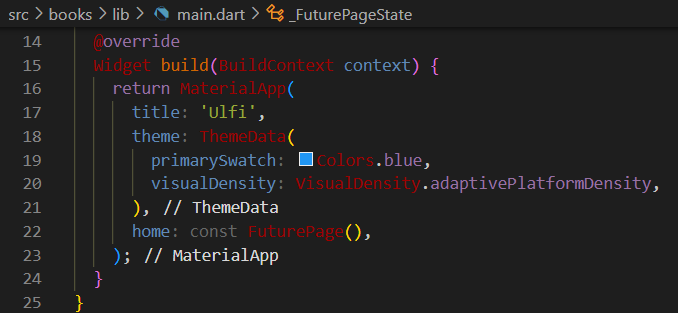
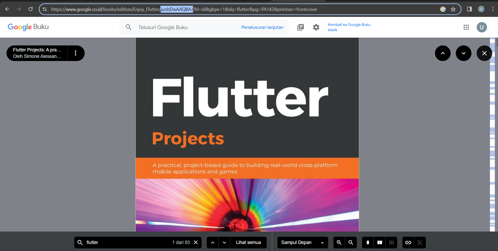
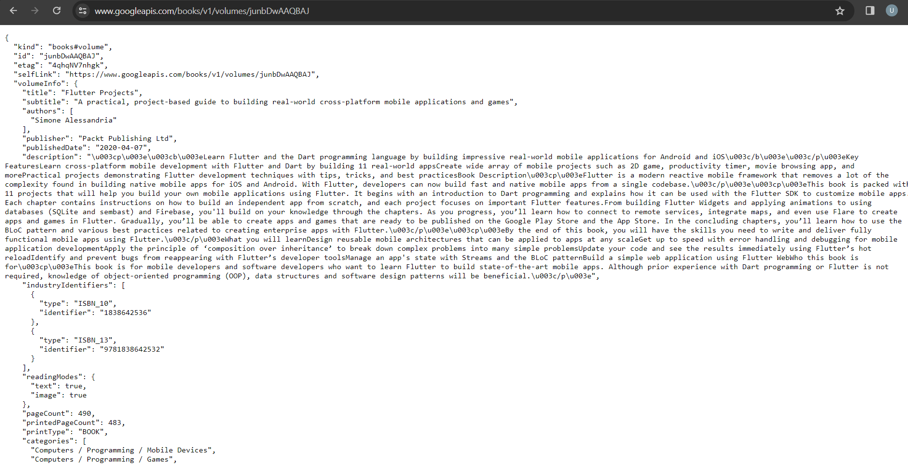
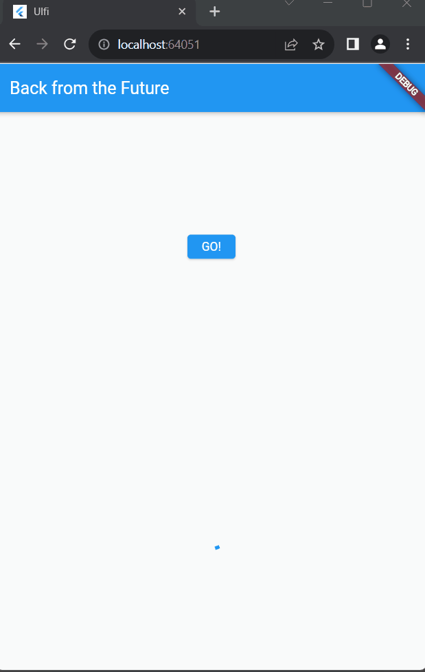
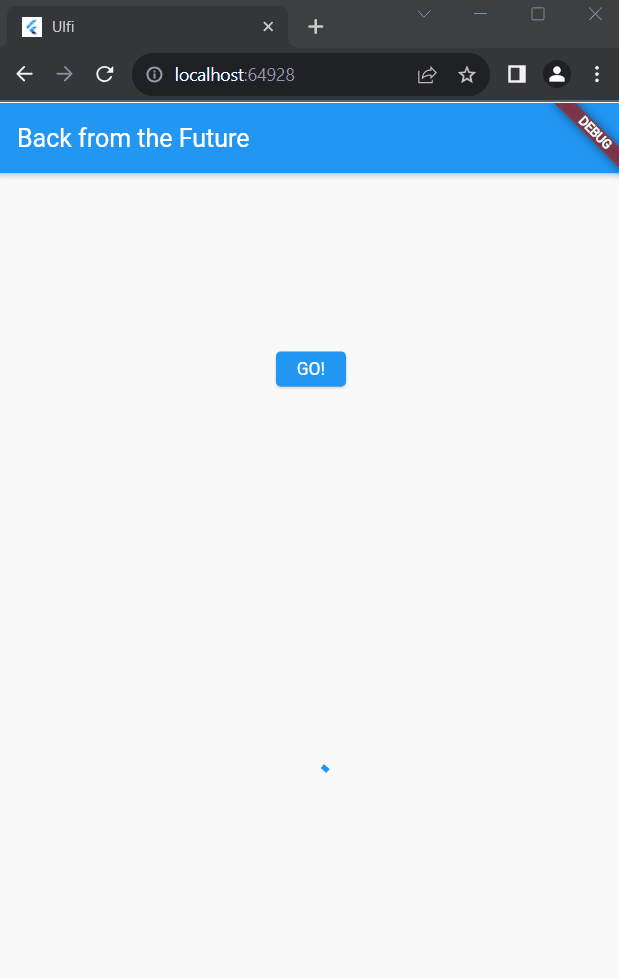
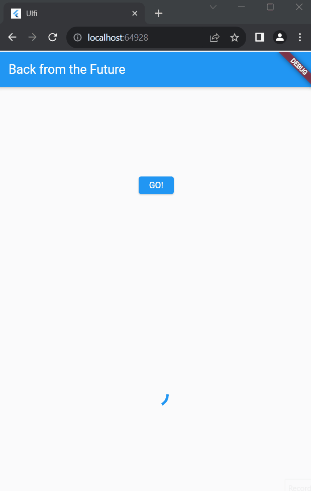

| Nama                                | No | NIM        |
| ----------------------------------- | -- | ---------- |
| Ulfi Mustatiq Abidatul Izza         | 26 | 2141720052 |

# Praktikum 1: Mengunduh Data dari Web Service (API)

## **Soal 1**

Tambahkan **nama panggilan** Anda pada title app sebagai identitas hasil pekerjaan Anda.



## **Soal 2**

- Carilah judul buku favorit Anda di Google Books, lalu ganti ID buku pada variabel path di kode tersebut. Caranya ambil di URL browser Anda seperti gambar berikut ini.



- Kemudian cobalah akses di browser URI tersebut dengan lengkap seperti ini. Jika menampilkan data JSON, maka Anda telah berhasil. Lakukan capture milik Anda dan tulis di README pada laporan praktikum. Lalu lakukan commit dengan pesan "W12: Soal 2".



## **Soal 3**

- Jelaskan maksud kode langkah 5 tersebut terkait `substring` dan `catchError`!

```dart
result = value.body.toString().substring(0, 450);
```
Fungsi **substring(0, 450)** digunakan untuk mengambil sebagian dari string yang dihasilkan oleh value.body.toString(). Pada kasus ini, dimulai dari karakter ke-0 hingga karakter ke-449. Artinya, hanya mengambil 450 karakter pertama dari string tersebut.

```dart
}).catchError((_){
   result = 'An error occurred';
   setState(() {});
});
```
**catchError** digunakan untuk menangkap dan menangani kesalahan (error) yang mungkin terjadi selama eksekusi **getData()**. Jika ada kesalahan, blok kode dalam **catchError** akan dieksekusi. Dalam hal ini, jika terjadi kesalahan selama pemanggilan **getData()**, variabel **result** akan diatur menjadi string "An error occurred", dan kemudian **setState((){})** dipanggil untuk memicu pembaruan tampilan.

- Capture hasil praktikum Anda berupa GIF dan lampirkan di README. Lalu lakukan commit dengan pesan "W12: Soal 3".



# Praktikum 2: Menggunakan await/async untuk menghindari callbacks

## **Soal 4**

- Jelaskan maksud kode langkah 1 dan 2 tersebut!

Langkah 1 menambahkan tiga metode asinkron (`returnOneAsync`, `returnTwoAsync`, dan `returnThreeAsync`) yang mensimulasikan operasi asinkron dengan penundaan waktu. 

Langkah 2 menambahkan metode `count` yang menjalankan operasi asinkron pada ketiga metode sebelumnya, menghitung totalnya, dan memperbarui tampilan UI dengan hasilnya.

- Capture hasil praktikum Anda berupa GIF dan lampirkan di README. Lalu lakukan commit dengan pesan "W12: Soal 4".



## **Soal 5**

- Jelaskan maksud kode langkah 2 tersebut!

1. Variable `completer`:

```dart
late Completer completer;
```
Variabel ini bertipe Completer, digunakan untuk menyelesaikan (complete) suatu Future. Dalam konteks ini, completer akan digunakan untuk menghasilkan hasil dari operasi asinkron yang dilakukan oleh metode calculate.

2. Metode `getNumber()`:

```dart
Future getNumber() {
  completer = Completer<int>();
  calculate();
  return completer.future;
}
```
Metode ini membuat instance baru dari Completer, kemudian memanggil metode calculate() dan mengembalikan hasil sebagai Future. Sebagai contoh, jika calculate menghasilkan angka 42, maka getNumber() akan mengembalikan Future dengan nilai 42.

3. Metode `calculate()`:
```dart
Future calculate() async {
  await Future.delayed(const Duration(seconds: 5));
  completer.complete(42);
}
```
Metode ini mensimulasikan operasi asinkron yang memerlukan waktu (dalam kasus ini, penundaan selama 5 detik dengan Future.delayed) dan kemudian menggunakan completer.complete(42) untuk menyelesaikan Future dengan nilai 42.

**Kesimpulan:**
Langkah 2 menambahkan mekanisme untuk menghasilkan nilai asinkron dengan menggunakan Completer dan dua metode getNumber() dan calculate(). Dengan ini, saat tombol "GO!" ditekan, getNumber() akan memulai operasi asinkron, dan setelah selesai, nilai 42 akan diterima dan ditampilkan di antarmuka pengguna.

- Capture hasil praktikum Anda berupa GIF dan lampirkan di README. Lalu lakukan commit dengan pesan "W12: Soal 5".

