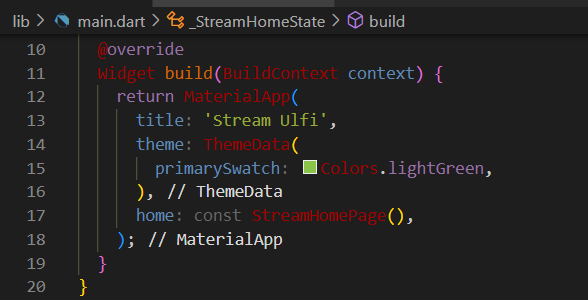
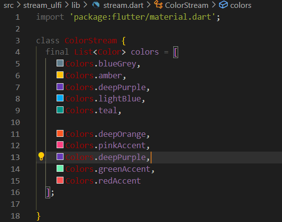

| Nama                                | No | NIM        |
| ----------------------------------- | -- | ---------- |
| Ulfi Mustatiq Abidatul Izza         | 26 | 2141720052 |

# Praktikum 1: Mengunduh Data dari Web Service (API)

## **Soal 1**

- Tambahkan nama panggilan Anda pada title app sebagai identitas hasil pekerjaan Anda.

- Gantilah warna tema aplikasi sesuai kesukaan Anda.

**Jawab:**



- Lakukan commit hasil jawaban Soal 1 dengan pesan "W13: Jawaban Soal 1"

## **Soal 2**

- Tambahkan 5 warna lainnya sesuai keinginan Anda pada variabel `colors` tersebut.

**Jawab:**



- Lakukan commit hasil jawaban Soal 2 dengan pesan "W13: Jawaban Soal 2"

## **Soal 3**

- Jelaskan fungsi keyword yield* pada kode tersebut!

**Jawab:**
Keyword `yield*` digunakan dalam Dart untuk memberikan hasil dari suatu async generator atau stream. Dalam konteks ini, yield* digunakan untuk menyediakan nilai-nilai dari suatu stream yang terus berjalan.

- Apa maksud isi perintah kode tersebut?

**Jawab:**
- `Stream.periodic`: Membuat stream yang menghasilkan nilai berulang setiap durasi tertentu.
- `const Duration(seconds: 1)`: Durasi setiap berapa detik stream akan menghasilkan nilai baru.
- `(int t)`: Fungsi yang akan dijalankan setiap kali stream menghasilkan nilai. `t` adalah indeks waktu (dalam detik) sejak stream dimulai.
- `int index = t % colors.length;`: Menghitung indeks warna yang akan digunakan. Ini memastikan bahwa kita tidak akan keluar dari indeks warna yang ada.
- `return colors[index];`: Mengembalikan warna sesuai dengan indeks yang dihitung.
- `async*`: Menandakan bahwa metode ini adalah asynchronous generator, dan `yield*` digunakan untuk mengirimkan nilai-nilai dari stream ke konsumen stream (pemanggil metode `getColors()`).

- Lakukan commit hasil jawaban Soal 3 dengan pesan "W13: Jawaban Soal 3"

## **Soal 4**

- Capture hasil praktikum Anda berupa GIF dan lampirkan di README.

**Jawab:**


- Lakukan commit hasil jawaban Soal 4 dengan pesan "W13: Jawaban Soal 4"

## **Soal 5**

- Jelaskan perbedaan menggunakan `listen` dan `await` for (langkah 9) !

**Jawab:**

1. Metode ChangeColor Menggunakan `listen`:

```dart
void changeColor() async {
  colorStream.getColors().listen((eventColor) {
    setState(() {
      bgColor = eventColor;
    });
  });
}
```
- Pendekatan `listen` digunakan ketika ingin terus mendengarkan perubahan pada stream tanpa harus menunggu pengiriman setiap elemen secara individual.

- Fungsi `listen` menerima callback yang akan dipanggil setiap kali ada perubahan pada stream.

- Ini bersifat asynchronous, dan callback dipanggil sesuai dengan perubahan pada stream.

2. Metode ChangeColor Menggunakan `await for` (Langkah 9):

```dart
void changeColor() async {
  await for (var eventColor in colorStream.getColors()) {
    setState(() {
      bgColor = eventColor;
    });
  }
}
```
- Pendekatan `await for` digunakan ketika ingin menunggu dan mengambil setiap elemen dari stream satu per satu.

- Ini bersifat synchronous, dan loop akan menunggu sampai ada elemen berikutnya yang dikirimkan oleh stream sebelum melanjutkan eksekusi.

- `await for` cocok untuk situasi di mana ingin menanggapi setiap elemen stream secara individual.

- Lakukan commit hasil jawaban Soal 5 dengan pesan "W13: Jawaban Soal 5"
