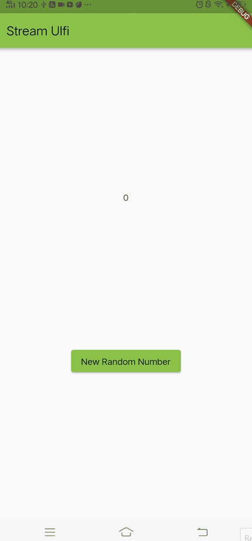
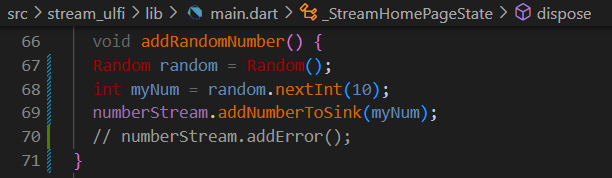
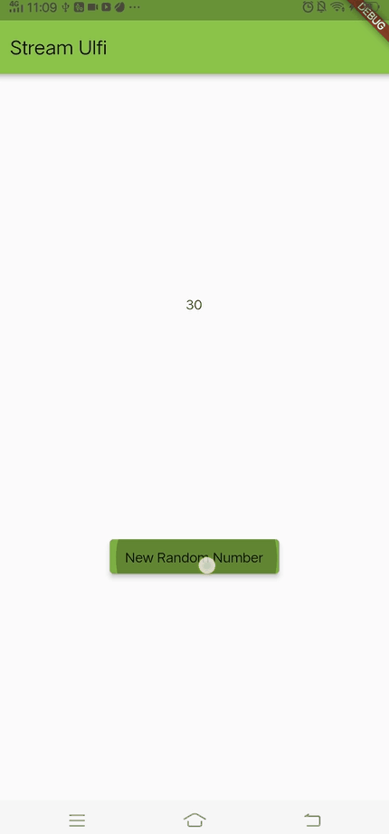
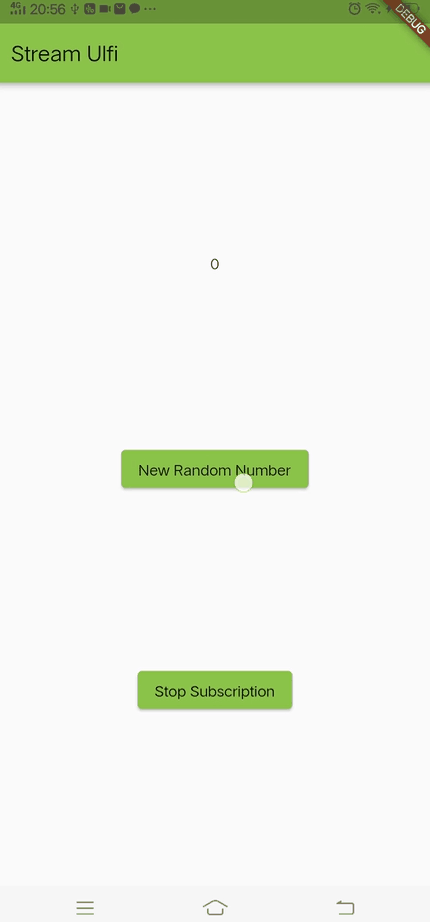
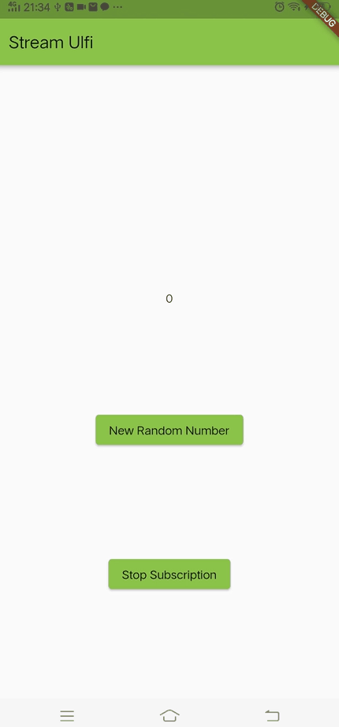

| Nama                                | No | NIM        |
| ----------------------------------- | -- | ---------- |
| Ulfi Mustatiq Abidatul Izza         | 26 | 2141720052 |

# Praktikum 1: Dart Streams

## **Soal 1**

- Tambahkan nama panggilan Anda pada title app sebagai identitas hasil pekerjaan Anda.

- Gantilah warna tema aplikasi sesuai kesukaan Anda.

**Jawab:**


- Lakukan commit hasil jawaban Soal 1 dengan pesan "W13: Jawaban Soal 1"

## **Soal 2**

- Tambahkan 5 warna lainnya sesuai keinginan Anda pada variabel `colors` tersebut.

**Jawab:**


- Lakukan commit hasil jawaban Soal 2 dengan pesan "W13: Jawaban Soal 2"

## **Soal 3**

- Jelaskan fungsi keyword yield* pada kode tersebut!

**Jawab:**

Keyword `yield*` digunakan dalam Dart untuk memberikan hasil dari suatu async generator atau stream. Dalam konteks ini, yield* digunakan untuk menyediakan nilai-nilai dari suatu stream yang terus berjalan.

- Apa maksud isi perintah kode tersebut?

```dart
yield* Stream.periodic(
  const Duration(seconds: 1), (int t) {
    int index = t % colors.length;
    return colors[index];
});
```

**Jawab:**
- `Stream.periodic`: Membuat stream yang menghasilkan nilai berulang setiap durasi tertentu.
- `const Duration(seconds: 1)`: Durasi setiap berapa detik stream akan menghasilkan nilai baru.
- `(int t)`: Fungsi yang akan dijalankan setiap kali stream menghasilkan nilai. `t` adalah indeks waktu (dalam detik) sejak stream dimulai.
- `int index = t % colors.length;`: Menghitung indeks warna yang akan digunakan. Ini memastikan bahwa kita tidak akan keluar dari indeks warna yang ada.
- `return colors[index];`: Mengembalikan warna sesuai dengan indeks yang dihitung.
- `async*`: Menandakan bahwa metode ini adalah asynchronous generator, dan `yield*` digunakan untuk mengirimkan nilai-nilai dari stream ke konsumen stream (pemanggil metode `getColors()`).

- Lakukan commit hasil jawaban Soal 3 dengan pesan "W13: Jawaban Soal 3"

## **Soal 4**

- Capture hasil praktikum Anda berupa GIF dan lampirkan di README.

**Jawab:**


- Lakukan commit hasil jawaban Soal 4 dengan pesan "W13: Jawaban Soal 4"

## **Soal 5**

- Jelaskan perbedaan menggunakan `listen` dan `await` for (langkah 9) !

**Jawab:**

1. Metode ChangeColor Menggunakan `listen`:

```dart
void changeColor() async {
  colorStream.getColors().listen((eventColor) {
    setState(() {
      bgColor = eventColor;
    });
  });
}
```
- Pendekatan `listen` digunakan ketika ingin terus mendengarkan perubahan pada stream tanpa harus menunggu pengiriman setiap elemen secara individual.

- Fungsi `listen` menerima callback yang akan dipanggil setiap kali ada perubahan pada stream.

- Ini bersifat asynchronous, dan callback dipanggil sesuai dengan perubahan pada stream.

2. Metode ChangeColor Menggunakan `await for` (Langkah 9):

```dart
void changeColor() async {
  await for (var eventColor in colorStream.getColors()) {
    setState(() {
      bgColor = eventColor;
    });
  }
}
```
- Pendekatan `await for` digunakan ketika ingin menunggu dan mengambil setiap elemen dari stream satu per satu.

- Ini bersifat synchronous, dan loop akan menunggu sampai ada elemen berikutnya yang dikirimkan oleh stream sebelum melanjutkan eksekusi.

- `await for` cocok untuk situasi di mana ingin menanggapi setiap elemen stream secara individual.

- Lakukan commit hasil jawaban Soal 5 dengan pesan "W13: Jawaban Soal 5"

# Praktikum 2: Stream controllers dan sinks

## **Soal 6**

- Jelaskan maksud kode langkah 8 dan 10 tersebut!

**Jawab:**

a. Langkah 8 (Edit initState):

```dart
@override
void initState() {
  numberStream = NumberStream();
  NumberStreamController = numberStream.controller;
  Stream<int> stream = NumberStreamController.stream;
  stream.listen((event) {
    setState(() {
      lastNumber = event;
    });
  });
  super.initState();
  // colorStream = ColorStream();
  // changeColor();
}
```
- `initState` adalah metode khusus dalam widget Flutter yang dipanggil ketika widget pertama kali dibuat.

- Pada langkah ini, kita membuat instance dari `NumberStream`, yang merupakan kelas untuk mengelola stream angka.

- `NumberStreamController` adalah objek `StreamController<int>` yang digunakan untuk mengontrol aliran data dari stream.

- Dengan mengambil stream dari `NumberStreamController`, kita menggunakan metode `listen` untuk mendengarkan perubahan pada stream tersebut.

- Ketika ada perubahan pada stream (yaitu, ketika angka baru ditambahkan), metode `setState` dipanggil untuk memperbarui tampilan dengan nilai angka terbaru (`lastNumber`).

b. Langkah 10 (Tambah method addRandomNumber):

```dart
void addRandomNumber() {
  Random random = Random();
  int myNum = random.nextInt(10);
  numberStream.addNumberToSink(myNum);
}
```
- Metode `addRandomNumber` ditambahkan untuk menambahkan angka acak ke dalam stream.

- Dalam metode ini, kita menggunakan kelas `Random` untuk menghasilkan angka acak antara 0 dan 9 (`random.nextInt(10)`).

- Kemudian, kita menggunakan metode `addNumberToSink` dari `numberStream` untuk menambahkan angka tersebut ke dalam sink stream, sehingga angka tersebut dapat dikirimkan ke widget dan ditampilkan di antarmuka pengguna.

- Capture hasil praktikum Anda berupa GIF dan lampirkan di README.

**Jawab:**



- Lalu lakukan commit dengan pesan "W13: Jawaban Soal 6".

## **Soal 7**

- Jelaskan maksud kode langkah 13 sampai 15 tersebut!

**Jawab:**

a. Langkah 13 (Tambahkan method `addError()` di dalam `stream.dart`):

```dart
void addError() {
  controller.sink.addError('error');
}
```
Penjelasan:
- Method `addError()` ditambahkan ke dalam kelas `NumberStream`.
- Metode ini digunakan untuk menambahkan pesan kesalahan ke dalam sink stream. Dengan menambahkan kesalahan, kita dapat menghasilkan event error dalam stream.

b. Langkah 14 (Tambahkan method `onError` di dalam `class _StreamHomePageState`):

```dart
stream.listen((event) {
  setState(() {
    lastNumber = event;
  });
}).onError((error) {
  setState(() {
    lastNumber = -1;
  });
});
```
Penjelasan:
- Kode ini menambahkan method `onError` pada hasil dari pemanggilan `listen` pada stream.
- Jika terjadi kesalahan (error) dalam stream, method `onError` akan dijalankan, dan kita mengatur nilai `lastNumber` menjadi -1.

c. Langkah 15 (Edit method `addRandomNumber()`):

```dart
void addRandomNumber() {
  Random random = Random();
  // int myNum = random.nextInt(10);
  // numberStream.addNumberToSink(myNum);
  numberStream.addError();
}
```
Penjelasan:
- Kode ini mengubah fungsi `addRandomNumber()` untuk memanggil `addError()` daripada menambahkan angka ke dalam stream.
- Dengan memanggil `addError()`, kita memicu pembangkitan kesalahan dalam stream.

- Kembalikan kode seperti semula pada Langkah 15, comment addError() agar Anda dapat melanjutkan ke praktikum 3 berikutnya.

**Jawab:**



- Lalu lakukan commit dengan pesan "W13: Jawaban Soal 7".

# Praktikum 3: Injeksi data ke streams

## **Soal 8**

- Jelaskan maksud kode langkah 1-3 tersebut!

**Jawab:**

a. Langkah 1 (Tambahkan variabel baru):

```dart
late StreamTransformer<int, int> transformer;
```

Penjelasan:
- Dengan menambahkan variabel `transformer`, Anda membuat sebuah objek `StreamTransformer` yang dapat digunakan untuk mengubah atau memanipulasi data yang melewati stream.

b. Langkah 2 (Tambahkan kode di initState):

```dart
transformer = StreamTransformer<int, int>.fromHandlers(
  handleData: (value, sink) {
    sink.add(value * 10);
  },
  handleError: (error, trace, sink) {
    sink.add(-1);
  },
  handleDone: (sink) => sink.close(),
);
```

Penjelasan:
- Kode ini menginisialisasi objek `transformer` dengan `StreamTransformer<int, int>.fromHandlers`.
- Pada `handleData`, setiap nilai yang melewati stream akan dikalikan dengan 10 sebelum disalurkan ke stream berikutnya.
- Pada `handleError`, jika terjadi kesalahan dalam stream, akan mengirimkan nilai -1 ke dalam stream.
- Pada `handleDone`, menutup sink untuk menandakan bahwa transformasi selesai.

c. Langkah 3 (Edit kode di initState):

```dart
stream.transform(transformer).listen((event) {
  setState(() {
    lastNumber = event;
  });
}).onError((error) {
  setState(() {
    lastNumber = -1;
  });
});
```

Penjelasan:
- Dalam langkah ini, kita menggunakan objek `transformer` untuk mengubah data yang melewati stream.
- Metode `listen` dijalankan pada hasil dari transformasi stream.
- Jika data berhasil diolah (tanpa kesalahan), nilai `lastNumber` diperbarui sesuai dengan hasil transformasi.
- Jika terjadi kesalahan, nilai `lastNumber` diatur menjadi -1 dalam metode `onError`.

- Capture hasil praktikum Anda berupa GIF dan lampirkan di README.



- Lalu lakukan commit dengan pesan "W13: Jawaban Soal 8".

# Praktikum 4: Subscribe ke stream events

## **Soal 9**

- Jelaskan maksud kode langkah 2, 6 dan 8 tersebut!

**Jawab:**

a. Langkah 2 (Edit initState()):

```dart
void initState() {
    numberStream = NumberStream();
    NumberStreamController = numberStream.controller;
    Stream<int> stream = NumberStreamController.stream;
    subscription = stream.listen((event) {
      setState(() {
        lastNumber = event;
      });
    });
    super.initState();
}
```

Penjelasan:
- Pada langkah ini, di dalam metode `initState()`, Anda membuat sebuah objek `NumberStream`, yang mencakup stream controller (`NumberStreamController`) dan stream (`stream`).
- Kemudian, Anda membuat sebuah subscription (`subscription`) untuk mendengarkan perubahan di dalam stream tersebut menggunakan metode `listen`. Ketika ada perubahan di dalam stream, metode `setState` dipanggil untuk memperbarui nilai `lastNumber`.
- `super.initState()` tetap dipanggil untuk menjalankan logika dari metode `initState` pada superclass.

b. Langkah 6 (Pindah ke method dispose()):

```dart
@override
void dispose() {
    // NumberStreamController.close();
    subscription.cancel();
    super.dispose();
}
```

Penjelasan:
- Pada langkah ini, di dalam metode `dispose()`, Anda menangani pelepasan sumber daya. Subscription (`subscription`) di-cancel untuk menghentikan pendengaran terhadap perubahan di dalam stream dan mencegah kebocoran memori.
- Jika diperlukan, Anda dapat menggunakan `NumberStreamController.close()` untuk menutup stream controller dan menghentikan aliran data.

c. Langkah 8 (Edit method addRandomNumber()):

```dart
void addRandomNumber() {
    Random random = Random();
    int myNum = random.nextInt(10);
    if (!NumberStreamController.isClosed) {
      numberStream.addNumberToSink(myNum);
    } else {
      setState(() {
        lastNumber = -1;
      });
    }
    // numberStream.addError();
}
```

Penjelasan:
- Pada langkah ini, di dalam metode `addRandomNumber()`, Anda menghasilkan angka acak dan menambahkannya ke dalam stream menggunakan metode `addNumberToSink` dari objek `numberStream`.
- Sebelum menambahkan angka ke dalam stream, Anda memeriksa apakah stream controller (`NumberStreamController`) sudah ditutup atau belum. Jika sudah ditutup, maka nilai `lastNumber` diatur ke -1 sebagai penanganan kasus stream tertutup.

- Capture hasil praktikum Anda berupa GIF dan lampirkan di README.

**Jawab:**



- Lalu lakukan commit dengan pesan "W13: Jawaban Soal 9".

# Praktikum 5: Multiple stream subscriptions

## **Soal 10**

- Jelaskan mengapa error itu bisa terjadi ?

**Jawab:**

Error "Bad state: Stream has already been listened to" terjadi karena mencoba untuk mendengarkan stream yang sudah memiliki pendengar (listener) sebelumnya. Dalam kasus ini, membuat dua subscription (`subscription` dan `subscription2`) untuk stream yang sama.

Pada bagian `initState`, membuat dua subscription dengan kode berikut:

```dart
subscription = stream.listen((event) {
  setState(() {
    values += '$event - ';
  });
});

subscription2 = stream.listen((event) {
  setState(() {
    values += '$event - ';
  });
});
```

Kedua subscription ini mendengarkan stream yang sama (`stream`), yang berasal dari `NumberStreamController.stream`. Ketika stream sudah memiliki pendengar (listener) dan kemudian mencoba untuk menambahkan pendengar (listener) lagi, Flutter melaporkan kesalahan ini karena suatu stream hanya dapat memiliki satu pendengar (listener).

Solusi untuk menghindari kesalahan ini adalah mungkin dengan membuat satu subscription saja atau memisahkan stream menjadi dua stream terpisah jika memerlukan dua pendengar (listener) yang berbeda. Misalnya, dapat membuat dua controller stream terpisah dan dua objek stream terpisah:

```dart
NumberStreamController = NumberStream().controller;
Stream<int> stream1 = NumberStreamController.stream;
Stream<int> stream2 = NumberStreamController.stream;

subscription = stream1.listen((event) {
  setState(() {
    values += '$event - ';
  });
});

subscription2 = stream2.listen((event) {
  setState(() {
    values += '$event - ';
  });
});
```

## **Soal 11**

- Jelaskan mengapa hal itu bisa terjadi ?

**Jawab:**

Hal ini terjadi karena menggunakan metode `asBroadcastStream()` pada objek stream (`stream`) di dalam metode `initState()`. Metode `asBroadcastStream()` mengubah stream menjadi broadcast stream, yang dapat memiliki beberapa pendengar. Namun, ketika membuat dua subscription (`subscription` dan `subscription2`), keduanya mendengarkan broadcast stream yang sama.

Dengan menggunakan `asBroadcastStream()`, stream akan mempertahankan satu salinan data dan menyebarkannya kepada semua pendengar yang terdaftar. Oleh karena itu, setiap kali menambahkan nomor acak dengan memanggil `addRandomNumber()`, stream akan memancarkan data ke semua pendengar yang terdaftar, termasuk `subscription` dan `subscription2`, yang menyebabkan nilai tersebut ditambahkan dua kali pada teks.

- Capture hasil praktikum Anda berupa GIF dan lampirkan di README.

**Jawab:**



- Lalu lakukan commit dengan pesan "W13: Jawaban Soal 10,11".

# Praktikum 6: StreamBuilder

## **Soal 12**

- Jelaskan maksud kode pada langkah 3 dan 7 !

**Jawab:**

a. Langkah 3: Pada langkah ini, membuat sebuah kelas bernama `NumberStream` yang memiliki metode `getNumbers()`. Metode ini mengembalikan `Stream<int>` yang menghasilkan angka acak antara 0 dan 9 setiap detiknya menggunakan `Stream.periodic`. Kode ini menggambarkan pembuatan stream yang menghasilkan angka acak setiap detik.

b. Langkah 7: Pada langkah ini, menggunakan `StreamBuilder` untuk membangun antarmuka pengguna yang dapat merespons perubahan pada stream angka. Widget ini memonitor stream (`numberStream`) dan membangun ulang tampilan setiap kali ada perubahan pada stream. Jika terdapat kesalahan (`snapshot.hasError`), kemudian mencetak pesan 'Error' ke konsol. Jika ada data yang baru (`snapshot.hasData`), kemudian menampilkan data tersebut dalam widget `Text` di tengah layar. Jika tidak ada data, kemudian mengembalikan widget kosong (`SizedBox.shrink()`).

- Capture hasil praktikum Anda berupa GIF dan lampirkan di README.

**Jawab:**


- Lalu lakukan commit dengan pesan "W13: Jawaban Soal 12".

# Praktikum 7: BLoC Pattern

## **Soal 13**

- Jelaskan maksud praktikum ini ! Dimanakah letak konsep pola BLoC-nya ?

**Jawab:**

Praktikum ini menunjukkan penggunaan BLoC (Business Logic Component) di Flutter untuk mengelola logika bisnis dan manajemen keadaan (state management). Konsep pola BLoC terletak pada penggunaan `RandomNumberBloc` yang merupakan kelas untuk mengelola logika bisnis terkait angka acak.

Berikut adalah penjelasan singkat:

a. **random_bloc.dart:**
   - `RandomNumberBloc` adalah kelas yang memiliki dua `StreamController`. 
   - `_generateRandomController` digunakan untuk input events, yaitu ketika tombol ditekan.
   - `_randomNumberController` digunakan untuk output Stream yang mengirimkan angka acak ke `RandomScreen`.
   - Ketika `_generateRandomController` mendengarkan event, ia menghasilkan angka acak dan mengirimkannya ke `_randomNumberController`.

b. **random_screen.dart:**
   - `RandomScreen` adalah StatelessWidget yang menangani tampilan dan interaksi pengguna.
   - Saat tombol ditekan, `_bloc.generateRandom.add(null)` dipanggil untuk mengirimkan event ke `RandomNumberBloc`.
   - `StreamBuilder` digunakan untuk mendengarkan perubahan pada `randomNumber` dari `RandomNumberBloc`. Saat ada perubahan, tampilan akan diperbarui dengan angka acak yang baru.

c. **main.dart:**
   - Di file `main.dart`, `MyApp` membangun aplikasi dengan menggunakan `RandomScreen` sebagai halaman utama.

Pola BLoC digunakan di sini untuk memisahkan logika bisnis (mendapatkan angka acak) dari tampilan (menampilkan angka acak). Ini membantu menjaga kode tetap terorganisir dan memungkinkan pengelolaan keadaan yang baik dalam aplikasi Flutter. BLoC membantu memisahkan antara tampilan dan logika bisnis, membuat aplikasi lebih mudah diuji dan dikelola.

- Capture hasil praktikum Anda berupa GIF dan lampirkan di README.

**Jawab:**


- Lalu lakukan commit dengan pesan "W13: Jawaban Soal 13"